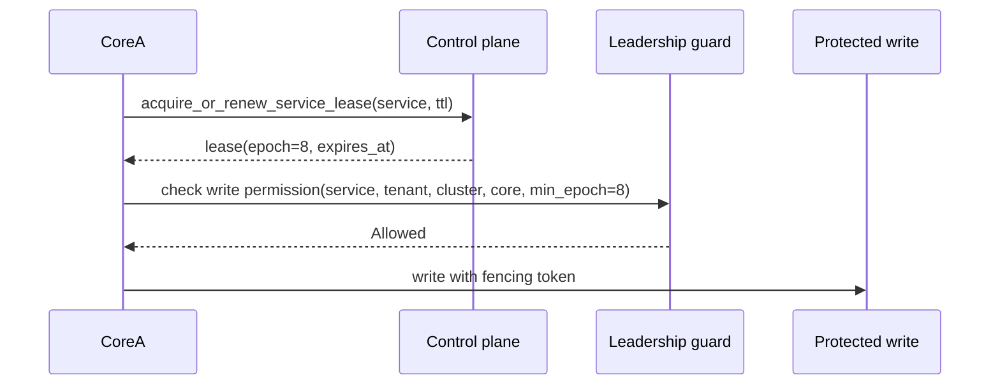

# Distributed Operation

Imagine two runtime cores after a network pause. One core still believes it is allowed to run a scheduled service. Another core has already renewed the lease and continued work. If both can write, the cluster corrupts its own state.

Distributed AppCore is built to make that situation explicit. The pieces are control plane, leases, discovery, Peer RPC, optional gateway mesh relay, and provider-selected coordination.

Private networking is not authentication. A node must still validate tenant, cluster, protocol, target core, nonce, expiry, payload hash, and credential binding.

## What problem does the control plane solve?

The control plane records runtime presence, heartbeats, peer discovery, and service-scoped leadership. The file control-plane provider is a crash-consistent reference implementation for a shared deployment directory.

Every file-control-plane operation:

1. takes an operating-system file lock;
2. reloads bounded validated state;
3. prunes stale registrations using the authoritative clock;
4. applies exactly one operation;
5. atomically persists the resulting state.

The durable state envelope has a format version and a maximum size. Unsupported versions fail with the same update-wall language used elsewhere: old state is not guessed into a new shape.

The control plane is not a business database. It answers runtime coordination questions: who is present, which peers are discoverable, and which core currently holds a service lease.

## Why is election not enough without fencing?

Leadership is scoped by service ID, not global runtime identity. A lease includes service, tenant, cluster, holder core, expiry, and epoch. The epoch is the fencing token.



A stale leader fails when:

- the lease expired;
- the holder core differs;
- tenant or cluster differs;
- the requested minimum epoch is newer than the held lease.

That is why AppCore documents "leader election" together with "fencing". Election chooses a holder. Fencing protects writes after leadership changes or delayed messages.

If a delayed old leader wakes up and attempts a protected write with an old epoch, the guard can reject it. This is the difference between "we elected someone" and "old work cannot still commit".

## Why are providers selected explicitly?

Deployment manifests select providers explicitly. The provider plan extracts storage, control plane, coordination store, secret provider, job provider, peer discovery, update provider, database provider, peer transport, command transport, and named adapters.

Provider factories are registered by role and provider ID. If the selected role/provider pair is unavailable, provider creation fails. There is no automatic fallback from remote to local, cluster to standalone, or secure to insecure.

## What does Peer RPC validate before dispatch?

Peer RPC envelopes bind:

- request ID;
- trace ID and optional trace context;
- protocol version;
- source core;
- target core;
- tenant;
- cluster;
- timestamp and expiry;
- nonce;
- capability;
- body hash;
- optional idempotency key.

Validation checks payload size, tenant, cluster, target core, protocol compatibility, time window, body hash, trace consistency, and nonce replay. The nonce store may be in-memory or file-backed. The file-backed store uses owner-private files, bounded JSON state, locks, and atomic replacement.

The peer token can also bind a request hash. That hash covers routing metadata and payload integrity so a bearer token cannot be replayed for a different peer request.

## Why does the gateway exist?

The gateway exists for Cores that can make outbound connections but cannot expose stable inbound ports. It is a relay, not a business API.

Gateway activation is declarative. Selecting the owned adapter in the
Deployment Manifest makes `appcore-bin` parse the bounded configuration, add
and authorize `runtime.gateway` in the shared capability catalog, reuse Runtime
security, and register the instance as a critical Supervisor-managed service:

```toml
[adapters.gateway]
provider_id = "appcore-gateway"
settings = { bind_address = "127.0.0.1:8080", domain_suffix = "gateway.example.com", heartbeat_interval_ms = "30000", heartbeat_timeout_ms = "90000" }
secret_refs = {}
```

Only those four non-secret settings are accepted. Unknown settings, endpoints,
secret references, and authentication overrides fail closed. If the adapter is
absent, no Gateway listener or task is created. Invalid configuration or bind
failure aborts startup rather than leaving a partially active host.

Worker and client connection tokens are short-lived, single-use, and bound to a request hash. Worker hashes bind tenant, cluster, installation, core, and advertised capabilities. Client hashes bind tenant, cluster, and device. Gateway mesh requests validate that the outer relay metadata matches the inner Peer RPC envelope.


The gateway never interprets opaque business payloads. It routes by tenant/core/capability and enforces bounded message sizes, timeouts, queue limits, and credential checks.

The host uses a durable process-safe replay store. Standalone mode places it in
private Runtime storage; cluster mode requires absolute
`paths.gateway_replay` pointing to a writable file shared by every Gateway
instance. Active sockets expire within 60 seconds. Bounded shutdown
force-closes incomplete connections before joining all Gateway-owned work.

## Limitations

- The file control-plane provider is a reference implementation for a shared deployment directory, not a globally distributed consensus system.
- Service leases require clocks and TTLs to be configured conservatively for the deployment.
- Peer RPC authenticates and bounds runtime envelopes; it does not define business authorization rules.
- The gateway relays opaque peer traffic and cannot resolve application-level conflicts.
- Cluster Gateway operation fails closed without an explicit shared replay
  file; the Runtime does not silently fall back to process-local replay state.
- Provider selection is strict. A missing provider fails startup instead of falling back to a weaker local option.

Continue with [supervisor and lifecycle](/architecture/supervisor).
