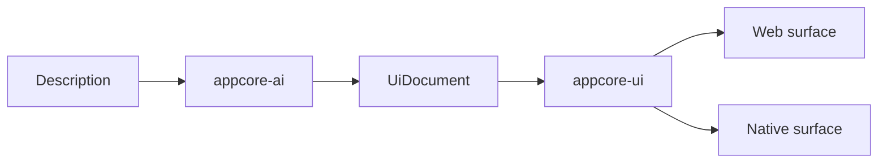
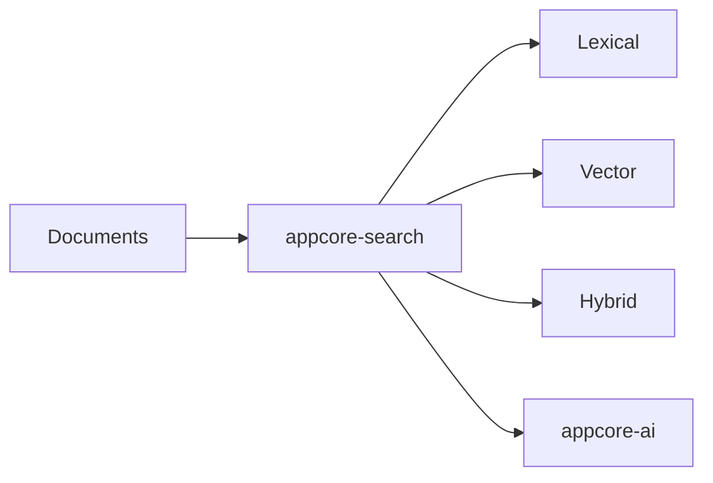
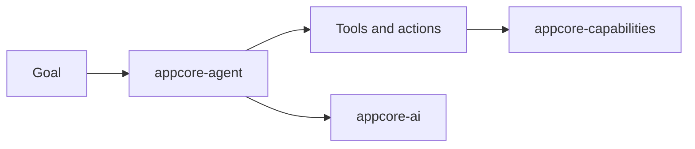
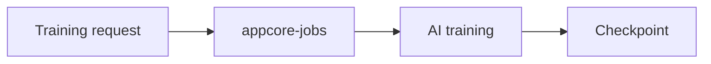
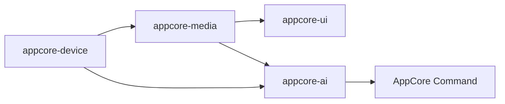
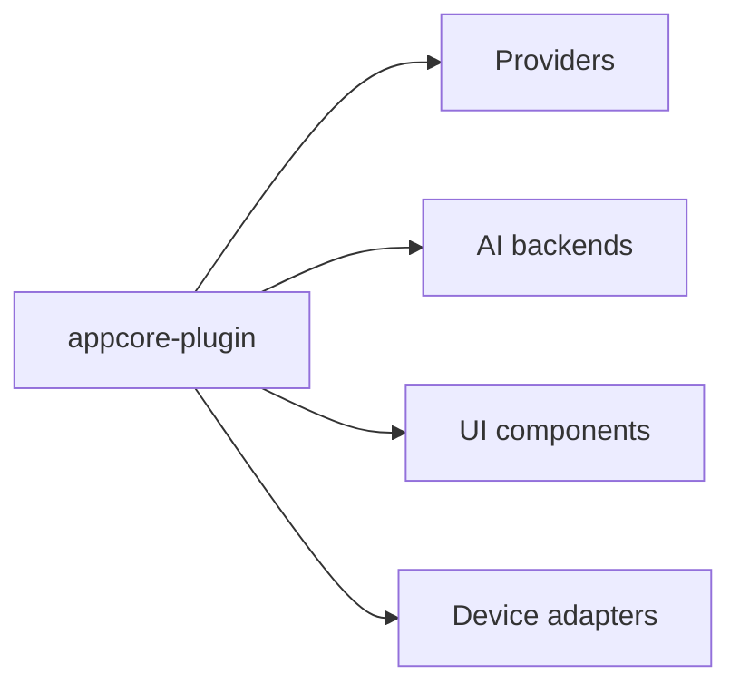

# Future Architecture

:::caution Conceptual roadmap
This page describes future architecture ideas. It does **not** change the
current Runtime architecture, the stable crate graph, or the 23 stable public crates
available today.
:::

Future AppCore work follows the same rule as the current Runtime: a crate exists
only when it has a clear owner, consumers, dependency boundary, tests,
publication path and documentation.

## Conceptual Flows

Deterministic automation and adaptive agents remain separate. Automation is
`Event -> Condition -> Action -> Command`. Agents handle goals, planning, tools,
memory and action proposals through AI and capabilities.

Training, if supported, should be explicit:

Media and devices are also boundaries, not hidden dependencies:

Plugins compose extension points:

## Profiles

The same future components can serve different runtime shapes:

- desktop application;
- AI desktop application;
- distributed backend;
- edge or IoT installation;
- media application;
- agent platform;
- visual development tool.

## Non-Goals

AppCore does not intend to become:

- an operating system;
- a universal database;
- a browser engine;
- a full machine-learning framework;
- a reinvented graphics engine;
- a custom cryptography stack;
- a cloud provider;
- a monolith.

## Principles

- Prefer the Rust standard library or internal crates before adding external dependencies.
- Keep local-first behavior possible.
- Use distributed operation only when the deployment needs it.
- Route extension through capabilities and explicit providers.
- Keep heavy features opt-in.
- Do not let implementation details leak into the central API.
- Require an owner, consumers, DAG position, tests, publication path and docs before creating a crate.

## Maturity

Research means the boundary is still being investigated. Planned means the
boundary is useful enough to reserve. In Design means the public shape is being
worked out. Alpha, Beta and RC indicate increasing implementation and release
confidence. Stable means the crate is published with its own SemVer contract.

Each crate may keep independent SemVer. Promotion is manual and should preserve
URLs where possible.
