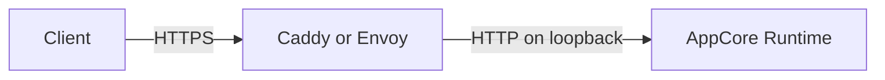

# Inbound TLS Sidecar

Inbound TLS belongs to the deployment boundary. AppCore listens only on a
loopback HTTP address; Caddy or Envoy owns the public TLS socket, certificates,
health checks and forwarding. The Runtime never reads the private key and does
not expose a cleartext fallback.

The 2.0 source line provides reference profiles for Caddy 2.11.4 on systemd,
launchd and Windows/WinSW, and Envoy 1.39.0 on systemd. This is development
status, not part of the stable 1.0 crate surface.

## Required deployment shape

- Bind the Runtime to `127.0.0.1:<port>` and deny remote access with the host firewall.
- Bind the sidecar externally with TLS only. Keep its admin endpoint on loopback.
- Keep certificate and key paths in protected deployment configuration; never put key bytes in manifests, arguments or logs.
- Start the Runtime first, then the sidecar. Publish the instance only after HTTPS `/v1/health` succeeds with hostname and chain validation.
- Treat external HTTPS health as readiness. Process liveness and direct loopback health are diagnostic signals only.

The templates live under `packaging/tls-sidecar` in the private beta source.
`appcore-dev service check` rejects removal of loopback upstream, TLS inputs,
bounded health checks, capacity limits or service-manager hardening.

## Rotation and rollback

Write and verify a complete certificate/key pair under a new owner-only path,
then publish it atomically. Caddy validates and reloads the candidate; Envoy
watches the certificate directory for atomic moves. Keep the previous pair
until external HTTPS health confirms the new certificate.

Validation or reload failure leaves or restores the previous pair. If the
sidecar stops, the public endpoint becomes unavailable and the Runtime port
must remain unreachable. If the Runtime stops, the sidecar reports an unhealthy
upstream and never forwards to another or cleartext destination.

Certificate rotation does not require an AppCore routing-generation change:
accepted requests remain owned by the sidecar while the Runtime listener stays
stable. Address changes still require deployment-owned external routing.

## Evidence and limitations

The rendered profiles were accepted by the official Caddy 2.11.4 and Envoy
1.39.0 images on Docker Linux/arm64. AC-024 remains open until real Unix and
Windows installations cover cleartext denial, rotation during accepted
requests, expiry/revocation, process loss, rollback and bounded load. Windows
production certification also depends on AC-009.

Continue with [coordinated HTTP reload](./reload).
