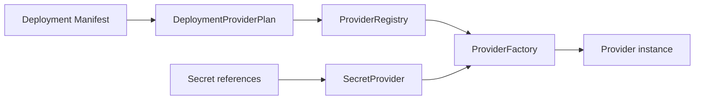

# Providers

The same application artifact may run on a developer laptop, a store notebook, or a clustered installation. If provider selection lived inside business code, every deployment would require a new application build.

Providers are AppCore's installation boundary. They let the deployment choose infrastructure without changing the application artifact.

## What does the deployment choose?

`DeploymentProviderPlan` extracts provider choices from `DeploymentManifestV1`:

- storage;
- control plane;
- coordination store;
- secret provider;
- job provider;
- peer discovery;
- update provider;
- database provider;
- peer transport;
- command transport;
- named adapters.

The provider context contains only non-secret installation identity: application ID, installation ID, and runtime mode.

## Why is there no implicit fallback?

A provider factory declares a role and provider ID. A registry rejects duplicate factories for the same role/provider pair. Creation looks up exactly the pair selected by the deployment manifest.

If the pair is not registered, creation fails. AppCore intentionally avoids implicit fallback because fallback changes deployment security and recovery semantics.

## What is the coordination store for?

The coordination-store provider owns runtime coordination schema metadata. The file implementation maintains `coordination-schema.meta` with a stable format and schema version. It migrates metadata forward to the current schema and rejects newer unsupported schema versions.

Runtime nodes do not receive generic business database credentials through this contract. The coordination store is for runtime-owned tables such as leases, runtime instances, capabilities, jobs, audit, tenants, and schema migrations.

## Why do manifests store secret references?

Deployment manifests store references such as `env:APPCORE_EXAMPLE_SECRET`. Factories receive a secret provider and resolve references after manifest validation. This keeps secret material out of portable manifests and out of application-owned configuration.

## What does a filesystem lease prove?

The reference shared-resource lease persists a versioned epoch high-water
sidecar before publishing an active lease. Release, restart, and interrupted
acquisition therefore cannot reuse an old epoch. The epoch is only a useful
fencing token when every protected writer compares it before writing; a shared
filesystem without reliable lock, rename, directory-sync, and cache-coherence
semantics cannot provide strong split-brain protection by itself.

## What should a production provider document?

A production provider should document:

- bounds for timeouts, retries, queues, and payloads;
- authentication and secret ownership;
- health and degradation behavior;
- persistence and recovery guarantees;
- migration and compatibility policy;
- redacted diagnostics;
- conformance and failure tests.

## Limitations

- Providers do not make incompatible deployment modes equivalent; standalone and cluster have different requirements.
- A missing selected provider fails creation instead of falling back.
- Secret providers resolve references, but AppCore does not operate a managed vault by itself.
- The coordination store is runtime-owned infrastructure, not a general application database.
- Provider health describes infrastructure availability, not business-level correctness.

Continue with [the first application tutorial](/tutorials/first-application).
