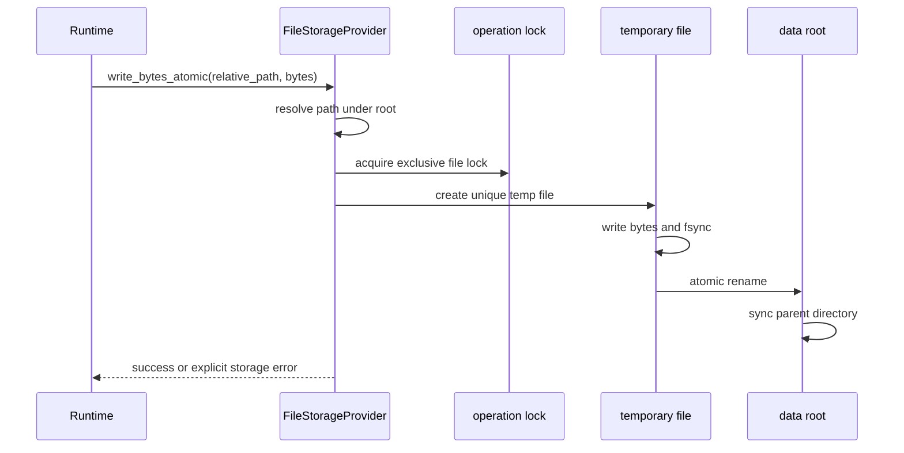
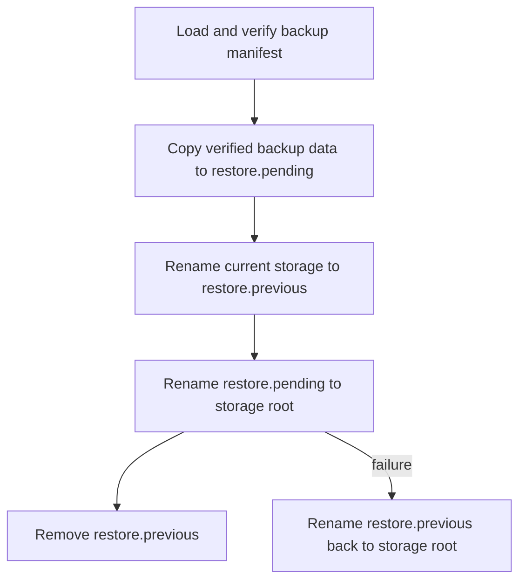
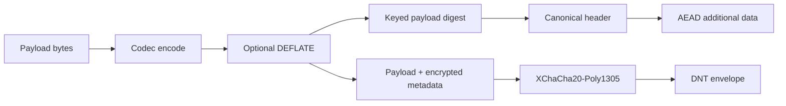

# Storage, DNT, Backup, and Restore

Imagine a local store that is writing a quotation when the notebook battery dies. On the next boot, the operator should not have to wonder whether the quotation file is half old data and half new data.

That is the storage problem AppCore cares about. AppCore storage is not an ORM and not a database abstraction. It is the runtime boundary for durable files, backup, restore, authentication-required reads, DNT-protected objects, and provider health.

The reference provider is a local file provider. Its behavior is deliberately conservative because it is used for runtime-owned state such as logs, snapshots, backup bundles, nonce stores, and coordination metadata.

## Why doesn't AppCore write directly into the final file?

Because an interrupted write would leave runtime state ambiguous. A partially written replication log, nonce store, backup manifest, or DNT object can be worse than a missing file: it may look valid enough for the next process to trust.

The file provider therefore treats a write as a small recovery protocol:

1. resolve the requested path below the configured storage root;
2. reject traversal, symlinks, and non-regular targets;
3. take the operation lock when consistency requires it;
4. write bytes into a unique temporary file;
5. flush the file to durable storage;
6. atomically rename the temporary file over the destination;
7. sync the parent directory where the platform supports it.

A local-first runtime needs a storage profile that works without a remote database. The file provider gives AppCore a predictable baseline:

- paths are resolved below configured roots;
- absolute paths, parent traversal, prefixes, and symlink components are rejected;
- writes use temporary files, `sync_all`, atomic rename, and parent-directory sync where supported;
- operations that need consistency take an operating-system file lock;
- unsupported transactions fail explicitly instead of pretending to exist.

The point is not that every filesystem is perfect. The point is that AppCore uses the strongest portable file pattern it can verify and reports an explicit storage error when an assumption does not hold.

## Why are reads bounded?

Several runtime formats are read as whole files because they must be verified as complete envelopes or manifests. Those reads are bounded. A file that is too large is rejected before unbounded memory allocation.

The same principle appears in sync logs, checkpoints, DNT files, backup manifests, update artifacts, peer nonce stores, and control-plane state.

This rule shows up repeatedly: sync logs, checkpoints, DNT files, backup manifests, update artifacts, peer nonce stores, and control-plane state all have explicit byte ceilings. AppCore assumes corrupted or hostile local files are possible.

## What happens during a snapshot backup?

Suppose an operator starts a backup while the store is closing for the day. A backup directory should either be absent or complete. It should not be published under its final name before the manifest and copied files agree.

The backup format is a complete local storage snapshot with a manifest:

- format marker: `appcore-storage-backup-v1`;
- backup name;
- creation time;
- sorted file inventory;
- per-file size;
- per-file SHA-256.

Backup creation stages into a temporary directory, copies regular files, writes a manifest, syncs file contents and directories, then renames the staged directory into place. Existing backup names are rejected. Symlinks are rejected. Backups are limited by file count and manifest size.

The manifest is the audit point. Restore does not trust a directory listing alone; it verifies the declared inventory, sizes, and SHA-256 values before activation.

## How can restore recover after a crash?

Restore is harder than backup because it temporarily has two truths: the old storage root and the verified candidate. AppCore makes the transition visible through fixed directory names rather than hidden state.

Restore is designed as a recoverable directory swap:

If a process dies during restore, `recover_snapshot_restore` runs when the provider creates directories. It chooses the safest available directory: pending if no current root exists, previous if that is the last good copy, and cleanup if current storage is already present.

## Why does DNT authenticate metadata?

DNT is the runtime's authenticated encrypted binary container. File extensions such as `.dnt`, `.dntj`, `.dntb`, and `.dnto` are conventions only; the header is the identity.

A DNT envelope contains:

- magic bytes `APDNT`;
- envelope version;
- flags;
- algorithm ID;
- application ID;
- optional tenant ID;
- logical content type;
- codec ID;
- key ID;
- schema version;
- creation time;
- payload length;
- XChaCha20-Poly1305 nonce;
- keyed payload hash;
- authenticated public metadata;
- encrypted metadata length;
- ciphertext.

The header is authenticated as AEAD additional data. That means the application ID, tenant ID, content type, codec, schema version, key ID, and metadata cannot be modified without failing authentication.

DNT reads require a maximum payload bound. `read_verified` rejects oversized files before loading the full buffer, then opens the envelope with context checks. `open_owned` can decrypt in place after reading an owned buffer. Returned plaintext can be zeroized by calling `zeroize_plaintext`.

## What trade-offs does this storage model make?

The file provider is simple and inspectable, but it is not a multi-writer distributed database. The local file profile expects one local process and filesystem semantics that honor locks, sync, and atomic rename. Cluster coordination uses explicit control-plane and coordination providers rather than pretending that a shared directory is a general database.

The alternative would be to require a database for every AppCore installation. That would simplify concurrency in cluster deployments but weaken the local-first story and make the smallest valid installation much heavier. AppCore instead keeps the local provider conservative and makes distributed coordination explicit.

## Limitations

- The file provider is not safe as a general multi-writer database across unrelated processes.
- AppCore cannot compensate for a filesystem that lies about locks, flushes, or atomic rename.
- Backups are runtime storage snapshots, not domain-aware consistency points across external databases.
- DNT protects bytes and authenticated context; it does not define business authorization policy.
- Restore protects the storage root it owns. It does not roll back external side effects performed by application code.

Continue with [synchronization, logs, checkpoints, and replay](/architecture/synchronization).
