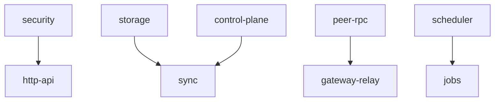
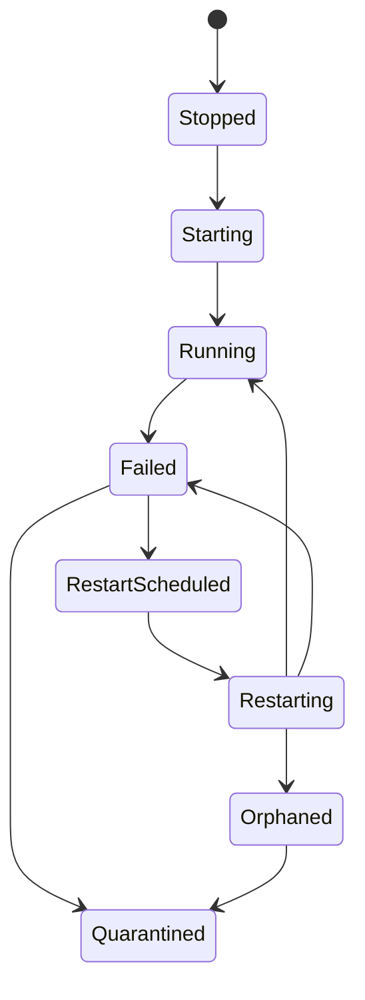

# Supervisor and Lifecycle

Suppose the sync receiver starts before storage is healthy. Or a gateway worker fails repeatedly and every failure spawns another restart attempt. A runtime without supervision turns those cases into hidden background behavior.

`appcore-supervisor` is process-local service orchestration. It starts and stops runtime-owned services, checks dependencies, tracks health, schedules bounded restarts, emits events, and exposes diagnostics.

It does not restart the AppCore process. That remains the job of systemd, launchd, Windows Service Control Manager, a container runtime, or another process manager.

## What is a managed service?

Each service supplies a descriptor:

- stable service name;
- managed resource type;
- dependencies;
- restart policy;
- activation state;
- whether failure is critical.

Service names are bounded and restricted to ASCII alphanumeric plus `.`, `-`, and `_`. A service cannot depend on itself. Dependency validation and topological ordering happen before `start_all`.

## How does startup avoid dependency races?

The supervisor starts enabled services in dependency order. Before starting one service, it checks dependency health against the declared requirement. A missing or insufficient dependency degrades dependents instead of starting a restart storm.

## Why are restarts scheduled instead of immediate?

Restart is scheduled, not performed inline. The supervisor:

1. checks whether restart is allowed and not already active;
2. consumes restart budget within a restart window;
3. adds backoff and jitter;
4. marks the service as scheduled;
5. submits a restart command to a bounded restart executor when due;
6. applies completion state.

If the restart queue is full, the system does not create unbounded work. If restart budget is exhausted, the service is quarantined and operator action is required.

## What happens when shutdown cannot prove a worker stopped?

Shutdown is cooperative. If a service cannot be stopped safely and a restart would leave an unknown worker behind, the supervisor records the service as orphaned and quarantined. It emits both orphan and quarantine events. This is safer than pretending the old worker is gone.

## What does the watchdog prove?

The watchdog gives health consumers a way to distinguish a responsive runtime from a stalled one. Deployment policy controls check interval and stall timeout. The watchdog is not a process supervisor; it is an internal signal that a process manager or operator can use.

## Why does this exist outside `appcore-core`?

The core runtime owns command dispatch, registries, audit, and lifecycle state. The supervisor owns managed-service orchestration. Keeping them separate prevents command dispatch from depending on concrete service restart machinery and lets infrastructure services share one lifecycle model.

## Limitations

- The supervisor does not restart the process. It only manages services inside the running process.
- Shutdown is cooperative; AppCore cannot safely kill arbitrary in-process user code.
- Restart budgets prevent storms, which means a repeatedly failing service can remain quarantined until an operator acts.
- Health checks describe runtime service health, not end-to-end business correctness.
- Dependency ordering prevents known startup races, but it does not make an unhealthy dependency healthy.

Continue with [updates](/architecture/updates).
