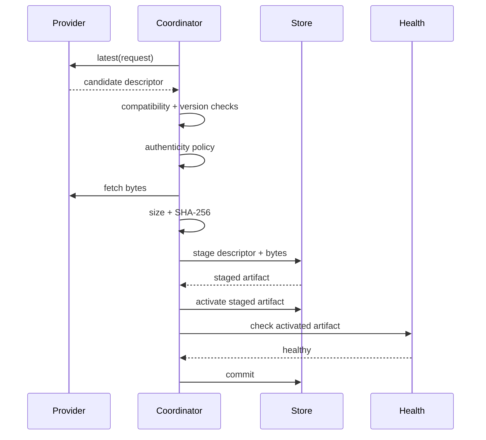

# Updates

Imagine an operator downloads an update successfully, but the new process cannot pass its health probe. Installing those bytes permanently would turn a recoverable deployment into downtime.

AppCore updates treat application artifacts as opaque bytes. The runtime validates identity, version movement, compatibility, authenticity, checksum, staging, activation, health, and rollback boundaries. It does not inspect application code or perform domain schema migration.

## Why is a newer file not automatically a valid update?

An update request contains the installed application identity, current version, and selected channel. The provider may return a candidate descriptor. The coordinator rejects the candidate if:

- application ID differs;
- channel differs;
- candidate version does not advance the installed version;
- the active artifact has a different application ID;
- candidate build ID reuses the active build ID;
- candidate version does not advance the active version;
- runtime requirement or protocol version is incompatible.

## What proves an artifact is allowed?

Production coordinators require an explicit artifact authenticity verifier. Ed25519 verification uses deployment-owned trust roots. Trust roots can be active, deprecated, or revoked. A revoked key rejects every artifact.

Policy can also allow exact channels and origins before signature verification. Development-only unsigned local artifacts require a compile-time feature and strict file-root checks; this is not an automatic fallback.

The signing payload covers stable descriptor fields: application ID, application version, build ID, channel, runtime requirement, protocol version, artifact reference, SHA-256, and size.

## What happens between download and commit?

The two-phase path exists for process-level health verification. A parent can stage and activate a candidate, restart/probe the child, then commit or rollback depending on observed health.

## When does rollback happen?

If activation fails after the previous artifact existed, the coordinator rolls back to the previous artifact and reports the attempted descriptor plus reason. Fault-injection points exist after selection, verification, staging, activation, health verification, and before commit so tests can prove rollback behavior.

## Why does update code care about filesystem shape?

Update file reads reject symlinks, non-regular files, and files above the configured byte limit. Activation revalidates staged size and SHA-256 before installing immutable build artifacts. Existing build paths are not overwritten unless they are exact-byte idempotent reuse.

## Limitations

- Updates do not perform business schema migrations automatically.
- They do not prove the new version is semantically correct; health checks only test the configured runtime probe.
- They do not manage external deployment credentials.
- Production requires an authenticity verifier. Unsigned local artifacts are development/test-only.
- Rollback is scoped to the artifact store and activation state; it cannot undo external side effects created by the new application version.

Continue with [security model](/security/security-model).
