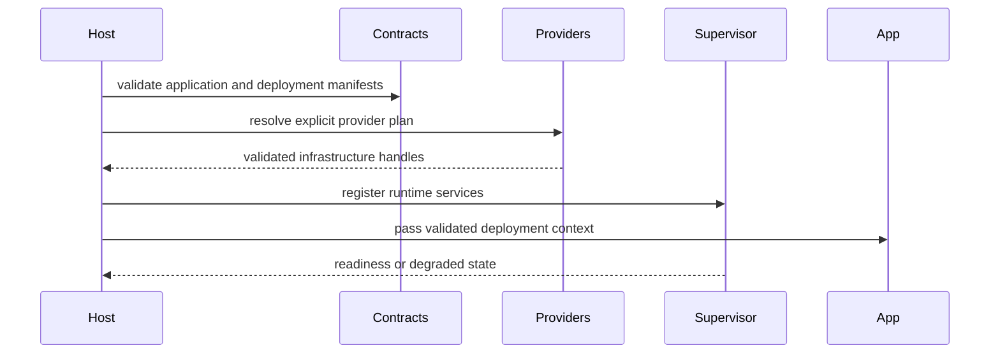

# Boot Sequence

## Introduction

Boot validates manifests, resolves providers and secrets, opens storage, starts infrastructure, registers application handlers, and exposes readiness.

## Contract boundary

The architecture keeps portable application requirements separate from installation-owned providers. Business code implements application behavior. Runtime crates own reusable infrastructure and reject implicit fallbacks when a required provider is missing.

## Operational consequences

| Concern | Runtime behavior | Owner outside the runtime |
| --- | --- | --- |
| Manifest validation | Fails before handlers start | Application author and installer |
| Secret references | Resolved after validation | Secret provider and operator |
| HTTP command/query API | Bounded DTOs and auth checks | TLS termination and edge policy |
| Sync | Sequence and hash-chain validation | Domain conflict policy |
| Supervision | Service restart/degrade/shutdown | OS process manager |

## Internal flow



## Examples

```toml
manifest_version = 1
installation_id = "local-dev"
mode = "standalone"

[providers.storage]
id = "file"
path = "./var/appcore/storage"

[secrets]
runtime_security = "env:APPCORE_RUNTIME_SECRET"
```

## Failure modes to test

- Missing provider ID.
- Unavailable secret reference.
- Duplicate or malformed authorization header.
- Exhausted lease epoch or stale fencing token.
- Oversized HTTP body, file log, snapshot, or backup.

## Limitations

AppCore gives structure for runtime infrastructure. It does not operate your external provider, prove domain correctness, terminate TLS by default, or replace process-level supervision.

## Related pages

- [Storage Model](/en/architecture/storage-model)
- [Security Model](/en/architecture/security-model)
- [Distributed Model](/en/architecture/distributed-model)
- [Supervisor Crate](/en/crates/appcore-supervisor)
