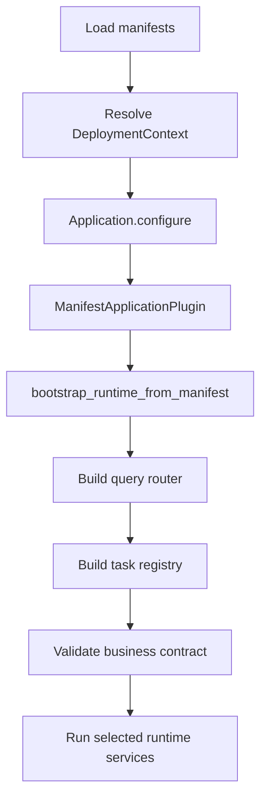

# Bootstrap and Runtime Host

Bootstrap is where AppCore turns files and application code into a running runtime. It is also the first trust boundary. Before an HTTP listener, sync receiver, scheduler, or application handler exists, the host must decide whether this installation is coherent enough to run.

The code path is intentionally narrow: `run_application` reads the standard manifest paths or the `APPCORE_APPLICATION_MANIFEST` and `APPCORE_DEPLOYMENT_MANIFEST` overrides, then creates a `ManifestApplicationHost`.

## Why does bootstrap fail early?

The runtime resolves both manifest paths with canonical filesystem paths and parses TOML into versioned manifest contracts. It then checks that both manifests refer to the same application ID.

Removed configuration shapes fail before the runtime attempts compatibility conversion:

- a file named `runtime.toml`;
- old inputs containing `app_id` without `manifest_version`.

The error text is intentionally direct: `NO MORE SUPPORTED PLEASE UPDATE`.

Failing early keeps invalid installations from half-starting services. A process that starts storage but not security, or API but not provider selection, is harder to diagnose than a process that refuses to boot with one explicit error.

## How do manifests become runtime config?

The host derives a `RuntimeConfig` from the two manifests:

- application ID becomes runtime app identity;
- installation ID becomes cluster/sync grouping material;
- runtime node/core/instance IDs are runtime-owned derived IDs;
- API listener comes from the first deployment listen address;
- cluster mode enables sync defaults;
- API payloads default to a bounded size;
- token TTL and idempotency TTL are runtime policy values;
- supervisor watchdog settings come from deployment policy.

Then deployment-specific settings are applied. The application never receives a raw deployment manifest and starts wiring providers itself; it receives a `DeploymentContext` with validated installation bindings.

## What does the application get to configure?

Once manifests and provider context are valid, the host asks the business implementation to register behavior:

Command dispatch is still guarded by the manifest. If the request names a capability that was not declared, the runtime rejects it. If a declared command requires an idempotency key and the request does not include one, the runtime rejects it before handler execution.

That order is important. Application code can register commands, queries, handlers, states, decisions, and tasks, but it does not choose undeclared capabilities after deployment validation. The manifest remains the contract that outside tools can inspect.

## When do runtime services start?

The host may start HTTP, sync receiver, peer RPC, control-plane worker, scheduler, update service, and other infrastructure depending on deployment mode and manifest requirements. These services are registered with the supervisor rather than started as detached threads.

The host exposes a probe path used by tests and certification: it starts selected services, waits for readiness up to a timeout, then gracefully shuts down and reports which services were observed.

## What does shutdown mean?

Shutdown is not a process kill. The host asks the runtime lifecycle to move through shutdown-requested and shutdown-completed states. Service shutdown remains cooperative. The supervisor can quarantine a service that does not stop, but it does not safely terminate arbitrary user code inside the process.

## Limitations

- Bootstrap does not infer providers or silently fall back to a different infrastructure choice.
- It does not migrate old unversioned inputs.
- It does not start business tasks outside runtime scheduling.
- It does not accept undeclared commands.
- It does not own process restart. If automatic updates are enabled, process-supervisor integration is required; direct unmanaged execution rejects that mode.

Continue with [storage, DNT, backup, and restore](/en/architecture/storage).
