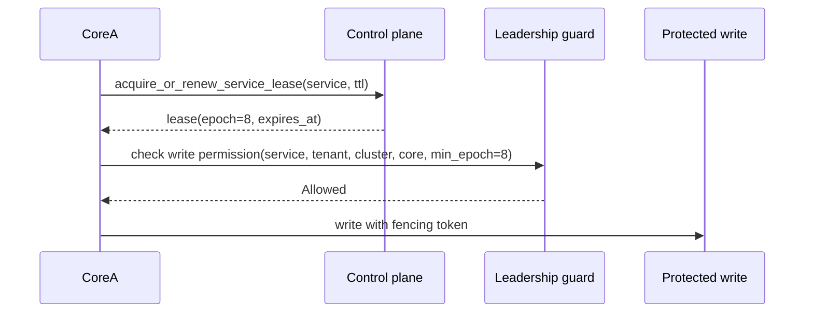

# Distributed Operation

Distributed AppCore is built from explicit pieces: control plane, leases, discovery, peer RPC, optional gateway mesh relay, and provider-selected coordination.

Private networking is not authentication. A node must still validate tenant, cluster, protocol, target core, nonce, expiry, payload hash, and credential binding.

## Control plane

The control plane records runtime presence, heartbeats, peer discovery, and service-scoped leadership. The file control-plane provider is a crash-consistent reference implementation for a shared deployment directory.

Every file-control-plane operation:

1. takes an operating-system file lock;
2. reloads bounded validated state;
3. prunes stale registrations using the authoritative clock;
4. applies exactly one operation;
5. atomically persists the resulting state.

The durable state envelope has a format version and a maximum size. Unsupported versions fail with the same update-wall language used elsewhere: old state is not guessed into a new shape.

## Service leases and fencing

Leadership is scoped by service ID, not global runtime identity. A lease includes service, tenant, cluster, holder core, expiry, and epoch. The epoch is the fencing token.

A stale leader fails when:

- the lease expired;
- the holder core differs;
- tenant or cluster differs;
- the requested minimum epoch is newer than the held lease.

That is why AppCore documents "leader election" together with "fencing". Election chooses a holder. Fencing protects writes after leadership changes or delayed messages.

## Provider composition

Deployment manifests select providers explicitly. The provider plan extracts storage, control plane, coordination store, secret provider, job provider, peer discovery, update provider, database provider, peer transport, command transport, and named adapters.

Provider factories are registered by role and provider ID. If the selected role/provider pair is unavailable, provider creation fails. There is no automatic fallback from remote to local, cluster to standalone, or secure to insecure.

## Peer RPC

Peer RPC envelopes bind:

- request ID;
- trace ID and optional trace context;
- protocol version;
- source core;
- target core;
- tenant;
- cluster;
- timestamp and expiry;
- nonce;
- capability;
- body hash;
- optional idempotency key.

Validation checks payload size, tenant, cluster, target core, protocol compatibility, time window, body hash, trace consistency, and nonce replay. The nonce store may be in-memory or file-backed. The file-backed store uses owner-private files, bounded JSON state, locks, and atomic replacement.

The peer token can also bind a request hash. That hash covers routing metadata and payload integrity so a bearer token cannot be replayed for a different peer request.

## Gateway mesh relay

The gateway exists for Cores that can make outbound connections but cannot expose stable inbound ports. It is a relay, not a business API.

Worker and client connection tokens are short-lived, single-use, and bound to a request hash. Worker hashes bind tenant, cluster, installation, core, and advertised capabilities. Client hashes bind tenant, cluster, and device. Gateway mesh requests validate that the outer relay metadata matches the inner Peer RPC envelope.

The gateway never interprets opaque business payloads. It routes by tenant/core/capability and enforces bounded message sizes, timeouts, queue limits, and credential checks.

Continue with [supervisor and lifecycle](/en/architecture/supervisor).

