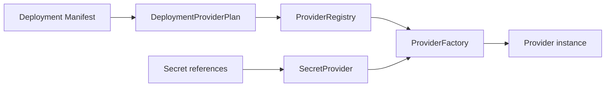

# Providers

Providers are AppCore's installation boundary. They let the deployment choose infrastructure without changing the application artifact.

## Provider plan

`DeploymentProviderPlan` extracts provider choices from `DeploymentManifestV1`:

- storage;
- control plane;
- coordination store;
- secret provider;
- job provider;
- peer discovery;
- update provider;
- database provider;
- peer transport;
- command transport;
- named adapters.

The provider context contains only non-secret installation identity: application ID, installation ID, and runtime mode.

## Registry and factories

A provider factory declares a role and provider ID. A registry rejects duplicate factories for the same role/provider pair. Creation looks up exactly the pair selected by the deployment manifest.

If the pair is not registered, creation fails. AppCore intentionally avoids implicit fallback because fallback changes deployment security and recovery semantics.

## Coordination store

The coordination-store provider owns runtime coordination schema metadata. The file implementation maintains `coordination-schema.meta` with a stable format and schema version. It migrates metadata forward to the current schema and rejects newer unsupported schema versions.

Runtime nodes do not receive generic business database credentials through this contract. The coordination store is for runtime-owned tables such as leases, runtime instances, capabilities, jobs, audit, tenants, and schema migrations.

## Secret providers

Deployment manifests store references such as `env:APPCORE_BACKEND_TEMPLATE_SECRET`. Factories receive a secret provider and resolve references after manifest validation. This keeps secret material out of portable manifests and out of application-owned configuration.

## Provider rules

A production provider should document:

- bounds for timeouts, retries, queues, and payloads;
- authentication and secret ownership;
- health and degradation behavior;
- persistence and recovery guarantees;
- migration and compatibility policy;
- redacted diagnostics;
- conformance and failure tests.

Continue with [the first application tutorial](/en/tutorials/first-application).

