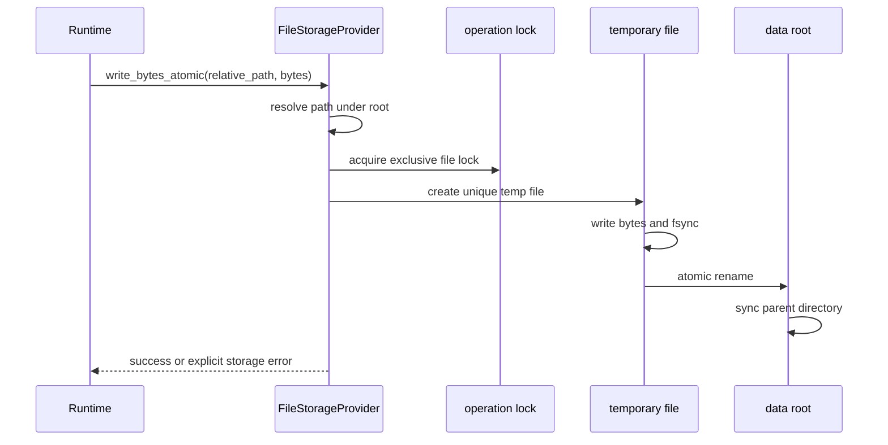
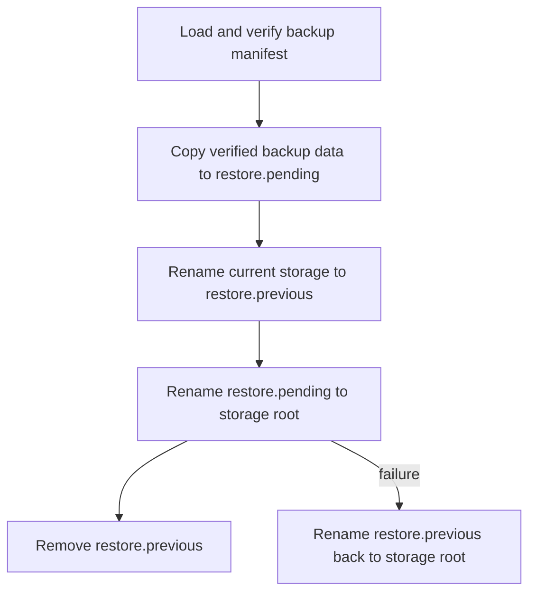
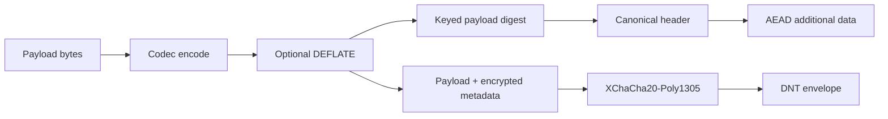

# Storage, DNT, Backup, and Restore

AppCore storage is not an ORM and not a database abstraction. It is a runtime boundary for durable files, backup, restore, authentication-required reads, DNT-protected objects, and provider health.

The reference provider is a local file provider. Its behavior is deliberately conservative because it is used for runtime-owned state such as logs, snapshots, backup bundles, nonce stores, and coordination metadata.

## Why the file provider exists

A local-first runtime needs a storage profile that works without a remote database. The file provider gives AppCore a predictable baseline:

- paths are resolved below configured roots;
- absolute paths, parent traversal, prefixes, and symlink components are rejected;
- writes use temporary files, `sync_all`, atomic rename, and parent-directory sync where supported;
- operations that need consistency take an operating-system file lock;
- unsupported transactions fail explicitly instead of pretending to exist.

## Bounded reads

Several runtime formats are read as whole files because they must be verified as complete envelopes or manifests. Those reads are bounded. A file that is too large is rejected before unbounded memory allocation.

The same principle appears in sync logs, checkpoints, DNT files, backup manifests, update artifacts, peer nonce stores, and control-plane state.

## Snapshot backup

The backup format is a complete local storage snapshot with a manifest:

- format marker: `appcore-storage-backup-v1`;
- backup name;
- creation time;
- sorted file inventory;
- per-file size;
- per-file SHA-256.

Backup creation stages into a temporary directory, copies regular files, writes a manifest, syncs file contents and directories, then renames the staged directory into place. Existing backup names are rejected. Symlinks are rejected. Backups are limited by file count and manifest size.

## Restore and crash recovery

Restore is designed as a recoverable directory swap:

If a process dies during restore, `recover_snapshot_restore` runs when the provider creates directories. It chooses the safest available directory: pending if no current root exists, previous if that is the last good copy, and cleanup if current storage is already present.

## DNT: encrypted portable storage objects

DNT is the runtime's authenticated encrypted binary container. File extensions such as `.dnt`, `.dntj`, `.dntb`, and `.dnto` are conventions only; the header is the identity.

A DNT envelope contains:

- magic bytes `APDNT`;
- envelope version;
- flags;
- algorithm ID;
- application ID;
- optional tenant ID;
- logical content type;
- codec ID;
- key ID;
- schema version;
- creation time;
- payload length;
- XChaCha20-Poly1305 nonce;
- keyed payload hash;
- authenticated public metadata;
- encrypted metadata length;
- ciphertext.

The header is authenticated as AEAD additional data. That means the application ID, tenant ID, content type, codec, schema version, key ID, and metadata cannot be modified without failing authentication.

DNT reads require a maximum payload bound. `read_verified` rejects oversized files before loading the full buffer, then opens the envelope with context checks. `open_owned` can decrypt in place after reading an owned buffer. Returned plaintext can be zeroized by calling `zeroize_plaintext`.

## Trade-offs

The file provider is simple and inspectable, but it is not a multi-writer distributed database. The local file profile expects one local process and filesystem semantics that honor locks, sync, and atomic rename. Cluster coordination uses explicit control-plane and coordination providers rather than pretending that a shared directory is a general database.

Continue with [synchronization, logs, checkpoints, and replay](/en/architecture/synchronization).

