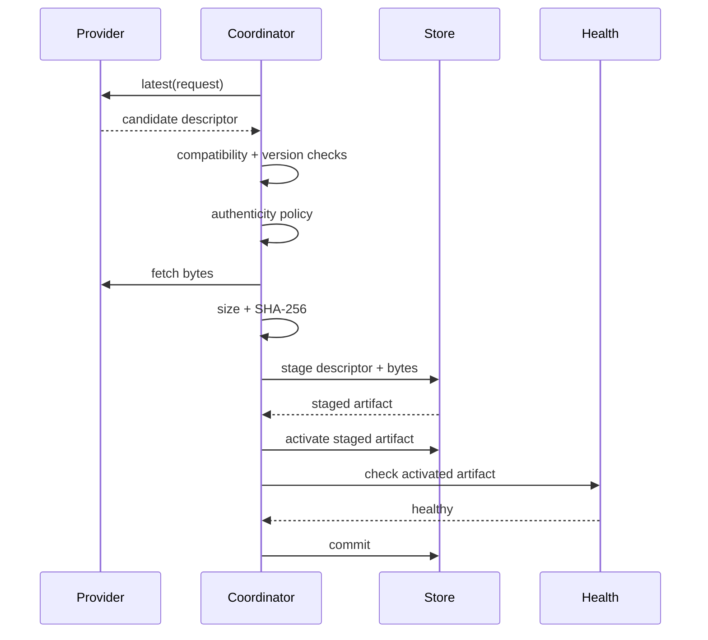

# Updates

AppCore updates treat application artifacts as opaque bytes. The runtime validates identity, version movement, compatibility, authenticity, checksum, staging, activation, health, and rollback boundaries. It does not inspect application code or perform domain schema migration.

## Candidate selection

An update request contains the installed application identity, current version, and selected channel. The provider may return a candidate descriptor. The coordinator rejects the candidate if:

- application ID differs;
- channel differs;
- candidate version does not advance the installed version;
- the active artifact has a different application ID;
- candidate build ID reuses the active build ID;
- candidate version does not advance the active version;
- runtime requirement or protocol version is incompatible.

## Authenticity and policy

Production coordinators require an explicit artifact authenticity verifier. Ed25519 verification uses deployment-owned trust roots. Trust roots can be active, deprecated, or revoked. A revoked key rejects every artifact.

Policy can also allow exact channels and origins before signature verification. Development-only unsigned local artifacts require a compile-time feature and strict file-root checks; this is not an automatic fallback.

The signing payload covers stable descriptor fields: application ID, application version, build ID, channel, runtime requirement, protocol version, artifact reference, SHA-256, and size.

## Staging and activation

The two-phase path exists for process-level health verification. A parent can stage and activate a candidate, restart/probe the child, then commit or rollback depending on observed health.

## Rollback

If activation fails after the previous artifact existed, the coordinator rolls back to the previous artifact and reports the attempted descriptor plus reason. Fault-injection points exist after selection, verification, staging, activation, health verification, and before commit so tests can prove rollback behavior.

## Filesystem safety

Update file reads reject symlinks, non-regular files, and files above the configured byte limit. Activation revalidates staged size and SHA-256 before installing immutable build artifacts. Existing build paths are not overwritten unless they are exact-byte idempotent reuse.

## What updates do not solve

Updates do not perform business schema migrations automatically, prove the new version is semantically correct, or manage external deployment credentials. Those remain application and operator responsibilities.

Continue with [security model](/en/security/security-model).

