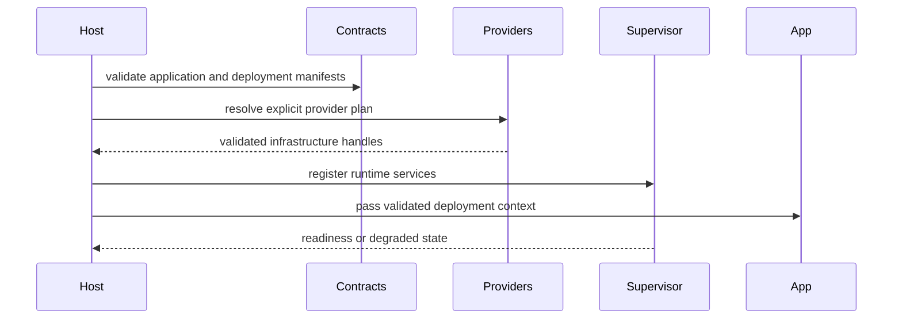

# appcore-core

## Objective

`appcore-core`: Generic in-process runtime lifecycle, command/event dispatch, state, decisions, audit, and idempotency.

## Responsibilities

Low-level compatibility API: `RuntimeBuilder` and `AppPlugin`. New apps normally enter through `appcore-bin`.

## Dependency direction

Crates should depend on lower-level contracts rather than concrete deployment choices. Provider implementations are selected through validated deployment manifests and registries.

## Nearby crates in the runtime

- `appcore-bin` is the manifest-first application facade and composition root.
- `appcore-transport` provides bounded HTTP/TLS client primitives shared by infrastructure crates.
- `appcore-scheduler` owns bounded one-shot, interval, and cron execution.
- `appcore-ops` contains vendor-neutral health, heartbeat, logging, metrics, and observations.
- `appcore-distributed-contracts` owns versioned control-plane and peer RPC wire/provider contracts.
- `appcore-provider-vercel-neon` is an isolated adapter for a Vercel API control-plane backed by an externally operated Neon coordination service.

## Internal flow



## Public API guidance

- Keep exported types version-aware and serializable where they cross crate or process boundaries.
- Do not expose provider-specific internals through stable contracts.
- Keep business concepts out of runtime crates.
- Use redacted debug output for payloads, credentials, nonces, and secret-bearing headers.

## Correct usage

```rust
use serde::{Deserialize, Serialize};
use std::collections::BTreeMap;

#[derive(Debug, Clone, Serialize, Deserialize)]
pub struct Command {
    pub tenant_id: String,
    pub idempotency_key: String,
    pub key: String,
    pub value: String,
}

#[derive(Debug, Clone, Serialize, Deserialize)]
pub enum Event {
    Recorded { key: String, value: String },
}

#[derive(Default)]
pub struct Service {
    accepted: BTreeMap<String, Event>,
    projection: BTreeMap<String, String>,
}

impl Service {
    pub fn handle(&mut self, command: Command) -> Event {
        if let Some(event) = self.accepted.get(&command.idempotency_key) {
            return event.clone();
        }
        let event = Event::Recorded { key: command.key.clone(), value: command.value.clone() };
        self.projection.insert(command.key, command.value);
        self.accepted.insert(command.idempotency_key, event.clone());
        event
    }
}
```

## Forbidden responsibilities

- Business schemas and workflows.
- Silent local or insecure fallback when a provider is unavailable.
- Unbounded queues, files, payloads, or retries.
- Secret material in manifests, logs, or debug output.

## Maturity

Part of the documented `1.0.1-rc.8` runtime line. Treat exact rustdoc signatures as the API reference for the crate version in use.

## Related pages

- [Workspace](/en/development/workspace)
- [Contracts](/en/crates/appcore-contracts)
- [Types](/en/crates/appcore-types)
- [Testing](/en/development/testing)
