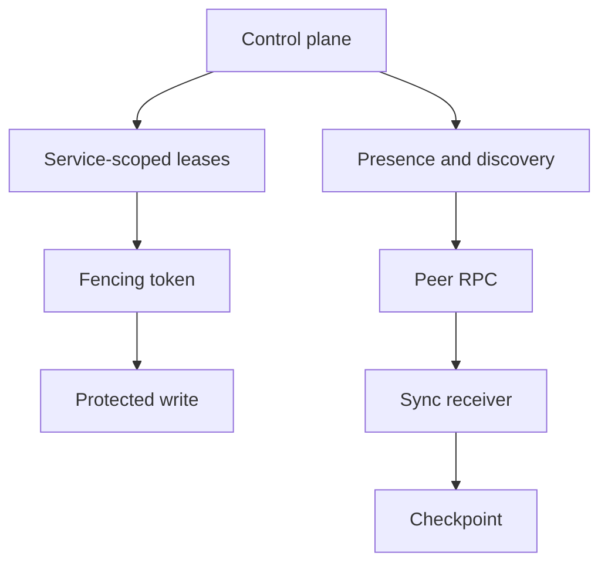

# Sync

## Introduction

This example focuses on checkpointed leader-to-follower exchange.

## Minimal pattern

```rust
use serde::{Deserialize, Serialize};
use std::collections::BTreeMap;

#[derive(Debug, Clone, Serialize, Deserialize)]
pub struct Command {
    pub tenant_id: String,
    pub idempotency_key: String,
    pub key: String,
    pub value: String,
}

#[derive(Debug, Clone, Serialize, Deserialize)]
pub enum Event {
    Recorded { key: String, value: String },
}

#[derive(Default)]
pub struct Service {
    accepted: BTreeMap<String, Event>,
    projection: BTreeMap<String, String>,
}

impl Service {
    pub fn handle(&mut self, command: Command) -> Event {
        if let Some(event) = self.accepted.get(&command.idempotency_key) {
            return event.clone();
        }
        let event = Event::Recorded { key: command.key.clone(), value: command.value.clone() };
        self.projection.insert(command.key, command.value);
        self.accepted.insert(command.idempotency_key, event.clone());
        event
    }
}
```

## Flow



## What to copy

- Stable command names.
- Idempotency handling.
- Tenant context.
- Explicit provider or transport assumptions.

## What not to copy blindly

- In-memory persistence for production.
- Missing authorization policy.
- Unbounded payloads.
- Direct coupling between API routes and storage records.

## Related pages

- [Tutorials](/en/tutorials/todo-app)
- [Concepts](/en/concepts/commands)
- [Operations](/en/operations/deployment)
