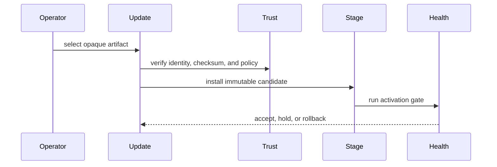

# Update

## Introduction

This example focuses on artifact staging and health-gated activation.

## Minimal pattern

```toml
manifest_version = 1
installation_id = "local-dev"
mode = "standalone"

[providers.storage]
id = "file"
path = "./var/appcore/storage"

[secrets]
runtime_security = "env:APPCORE_RUNTIME_SECRET"
```

## Flow



## What to copy

- Stable command names.
- Idempotency handling.
- Tenant context.
- Explicit provider or transport assumptions.

## What not to copy blindly

- In-memory persistence for production.
- Missing authorization policy.
- Unbounded payloads.
- Direct coupling between API routes and storage records.

## Related pages

- [Tutorials](/en/tutorials/todo-app)
- [Concepts](/en/concepts/commands)
- [Operations](/en/operations/deployment)
