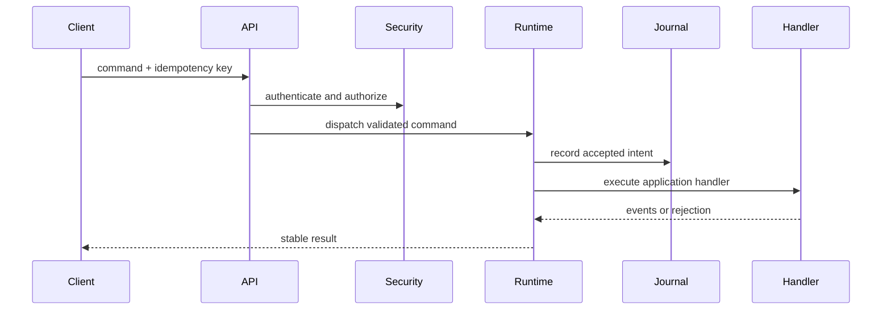

# First Storage

## Introduction

This page turns the runtime contract into a concrete first step. The important shape is stable: a portable Application Manifest, an installation-owned Deployment Manifest, and business code implementing `Application`.

## Steps

1. Write accepted intent before projection.
2. Keep business schema outside runtime crates.
3. Use bounded local file storage for the first profile.
4. Back up journals and snapshots together.

## Minimal application

```rust
use appcore_bin::application::{run_application, Application, ApplicationResult};

struct BackendApplication;

impl Application for BackendApplication {
    fn name(&self) -> &'static str {
        "notes-backend"
    }

    fn register(&self, app: &mut appcore_bin::application::ApplicationBuilder) -> ApplicationResult<()> {
        app.command("notes.create", |ctx, payload| {
            ctx.audit("notes.create.accepted")?;
            Ok(payload)
        })?;
        Ok(())
    }
}

fn main() {
    if let Err(error) = run_application(&BackendApplication) {
        eprintln!("application failed: {error}");
        std::process::exit(1);
    }
}
```

## Application Manifest

```toml
manifest_version = 1
application_id = "notes"
service_id = "notes-api"
minimum_runtime_version = "1.0.1-rc.8"
protocol = "appcore.runtime/1"

[capabilities.notes]
kind = "Functional"
commands = ["notes.create", "notes.update"]
queries = ["notes.list"]
```

## Deployment Manifest

```toml
manifest_version = 1
installation_id = "local-dev"
mode = "standalone"

[providers.storage]
id = "file"
path = "./var/appcore/storage"

[secrets]
runtime_security = "env:APPCORE_RUNTIME_SECRET"
```

## Internal flow



## Common mistakes

- Putting provider IDs or local paths in `application.toml`.
- Storing raw secrets in `deployment.toml`.
- Importing private host modules from application code.
- Building business REST resources inside runtime infrastructure crates.

## Limitations

The compact examples show the integration shape. Production deployment still requires TLS termination, secret management, backup policy, capacity planning, and application-owned authorization rules.

## Related pages

- [Manifests](/en/concepts/manifests)
- [Runtime](/en/architecture/runtime)
- [Deployment](/en/operations/deployment)
