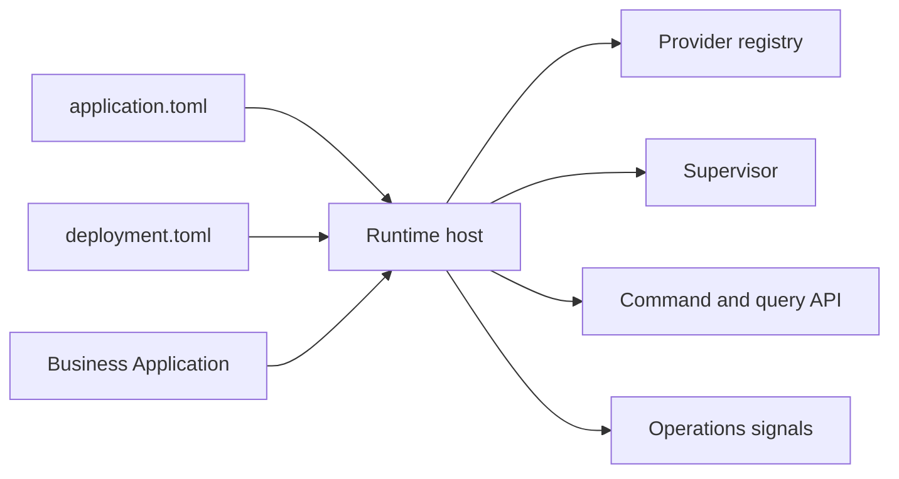

# AppCore Runtime

AppCore Runtime is a distributed, modular, local-first Rust runtime for hosting applications. It owns reusable infrastructure: lifecycle, manifests, commands, queries, audit, storage contracts, security, scheduling, synchronization, capability routing, peer RPC, control-plane coordination, observability, supervision, and application updates.

Current candidate: `1.0.1-rc.8`. Minimum Rust toolchain: `1.89`.

It is not an ERP, a business application, a general web framework, OAuth, a managed vault, a database engine, or a consensus system.

## Start here

- [What Is AppCore](/en/introduction/what-is-appcore)
- [Installation](/en/getting-started/installation)
- [Architecture Overview](/en/architecture/overview)
- [Project Status](/en/introduction/project-status)
- [Roadmap](/en/development/roadmap)

