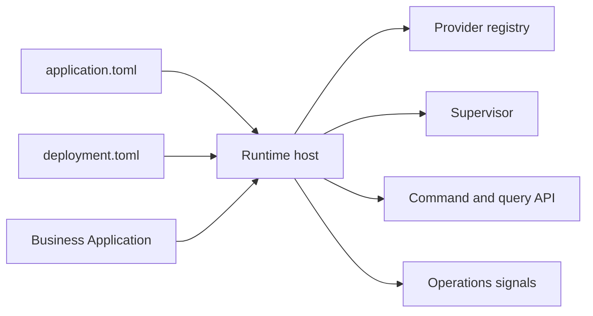

# What Is AppCore

## Introduction

AppCore is a manifest-first runtime for Rust applications that need infrastructure behavior to be explicit and testable.

Current candidate: `1.0.1-rc.8`. Minimum Rust toolchain: `1.89`.

## Reading model

Read AppCore as a set of contracts rather than a monolith. `appcore-contracts` defines manifests and policy structures, `appcore-bin` composes the host, low-level crates provide bounded infrastructure, and application repositories provide domain behavior.

## Use it when

- The application must run from portable manifests.
- Installation choices must not leak into business code.
- Commands, queries, audit, storage, sync, scheduling, and supervision need one runtime model.
- You need local-first or distributed operation with explicit provider choices.

## Avoid it when

- A stateless HTTP handler is enough.
- You need an ORM or managed database abstraction.
- You expect built-in business workflows.
- You need multi-master consensus semantics.

## Related pages

- [Installation](/en/getting-started/installation)
- [Architecture Overview](/en/architecture/overview)
- [Project Status](/en/introduction/project-status)
