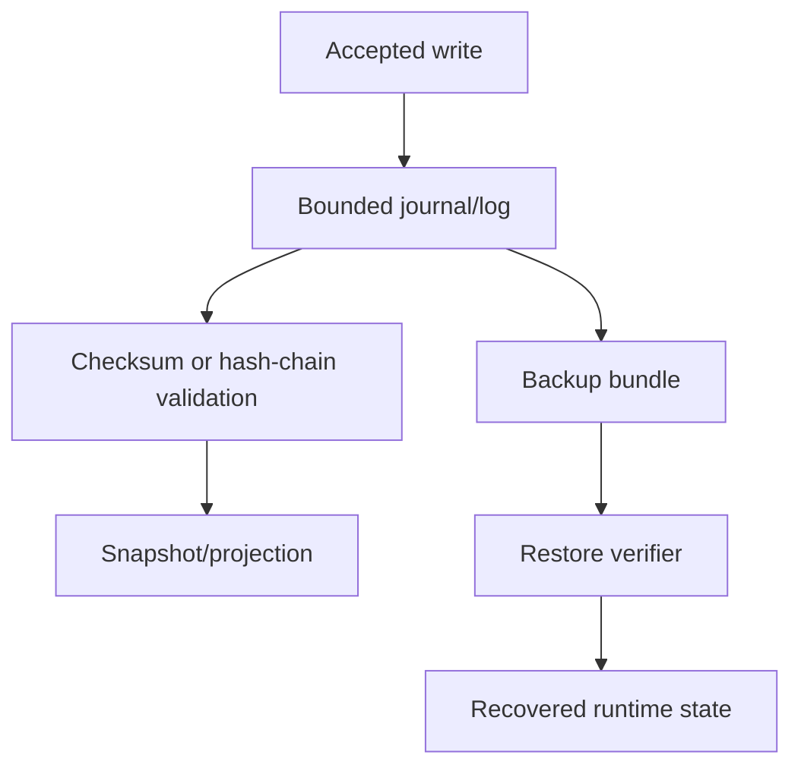

# Troubleshooting

## Introduction

Operations covers diagnosis of bootstrap, provider, API, sync, storage, update, and supervisor failures.

## Runbook shape

1. Confirm the runtime version and manifest versions.
2. Validate provider availability and secret references.
3. Check service health and degraded reasons.
4. Inspect bounded logs and metrics using correlation IDs.
5. Decide whether to retry, degrade, roll back, restore, or stop.

## Commands

```bash
make doctor
make docs.check
make verify
make ci
make release.local
```

## Internal flow



## Operator checklist

- Do not set `require_auth = false` on an untrusted listener.
- Keep inbound TLS and edge policy explicit.
- Rehearse restore before relying on backups.
- Treat unavailable providers as bootstrap failures, not fallback opportunities.
- Keep process supervision outside the runtime supervisor.

## Limitations

AppCore exposes operational state and contracts. It does not operate cloud accounts, rotate external credentials automatically, provision TLS, or choose customer-specific backup retention.

## Related pages

- [Secure Deployment](/en/security/secure-deployment)
- [Supervisor](/en/crates/appcore-supervisor)
- [Troubleshooting](/en/operations/troubleshooting)
