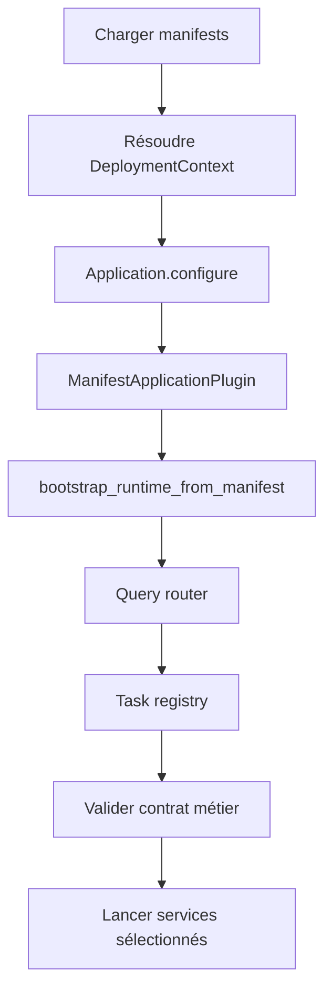

# Bootstrap et runtime host

Bootstrap commence dans `run_application`. C'est la première frontière de confiance : avant API, sync receiver ou handler applicatif, le host décide si l'installation est cohérente.

Le host lit `application.toml` et `deployment.toml` ou les overrides `APPCORE_APPLICATION_MANIFEST` et `APPCORE_DEPLOYMENT_MANIFEST`, valide les manifests et crée `ManifestApplicationHost`.

Les chemins sont canonicalisés, le TOML est parsé dans des contrats versionnés et les deux manifests doivent partager le même `application_id`. Les entrées supprimées, comme `runtime.toml` ou les configs anciennes avec `app_id` sans `manifest_version`, échouent avec `NO MORE SUPPORTED PLEASE UPDATE`.

Le runtime dérive `RuntimeConfig` : IDs node/core/instance appartiennent au runtime, listener vient du deployment, cluster mode active sync, payloads sont bornés, TTLs sont politique runtime et watchdog vient du deployment.

Les commands restent protégées par le manifest. Capability absente échoue. Command exigeant une idempotency key échoue avant le handler si la clé manque.

## Limitations

- Bootstrap n'infère pas les providers et ne fait pas de fallback silencieux.
- Les anciennes configs non versionnées ne sont pas converties.
- Les tasks métier ne démarrent pas hors scheduler runtime.
- Les commands non déclarées dans le manifest sont rejetées.
- L'update automatique exige le chemin supervisé ; une exécution directe non managée rejette ce mode.

Suivant : [storage](/fr/architecture/storage).
