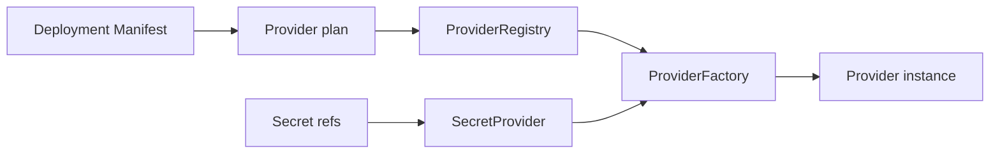

# Providers

Providers sont la frontière d'installation. Le deployment choisit l'infrastructure sans changer l'artefact applicatif.

`DeploymentProviderPlan` extrait storage, control plane, coordination store, secret provider, jobs, discovery, update, database, peer transport, command transport et adapters.

Une factory est enregistrée par role et provider ID. Si la paire sélectionnée n'existe pas, creation échoue. Il n'y a pas de fallback implicite.

Suivant : [première application](/fr/tutorials/first-application).

