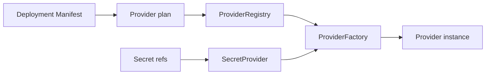

# Providers

La même application peut tourner sur un laptop, un notebook de boutique ou un cluster. Si le choix d'infrastructure vit dans le code métier, chaque installation devient un build différent.

Providers sont la frontière d'installation. Le deployment choisit l'infrastructure sans changer l'artefact applicatif.

`DeploymentProviderPlan` extrait storage, control plane, coordination store, secret provider, jobs, discovery, update, database, peer transport, command transport et adapters.

Une factory est enregistrée par role et provider ID. Si la paire sélectionnée n'existe pas, creation échoue. Il n'y a pas de fallback implicite.

Le coordination store est runtime-owned, pas une base métier. Le secret provider résout les références après validation afin que les valeurs ne vivent pas dans les manifests.

## Limitations

- Providers ne rendent pas standalone et cluster équivalents ; chaque mode a ses exigences.
- Provider sélectionné et absent échoue la creation au lieu de fallback.
- Secret provider résout des références, mais AppCore ne fournit pas de vault managé.
- Coordination store est infrastructure runtime, pas database applicative.
- Health provider indique disponibilité d'infrastructure, pas correction métier.

Suivant : [première application](/fr/tutorials/first-application).
