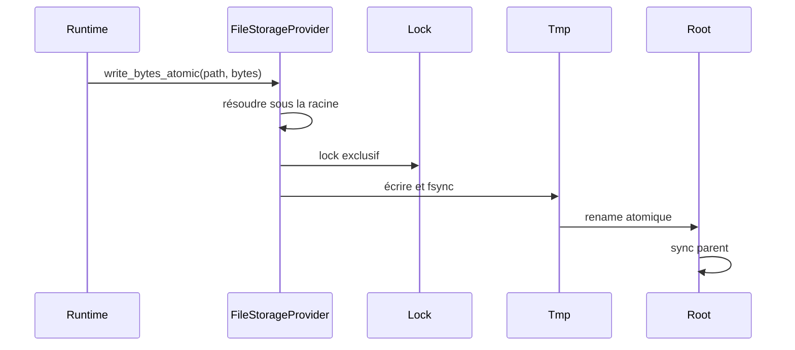

# Storage, DNT, backup et restore

Le storage AppCore n'est pas un ORM. C'est la frontière runtime pour fichiers durables, backup, restore, objets DNT, lectures authentifiées et health du provider.

Le file provider rejette chemins absolus, `..`, prefixes et symlinks sous la racine. Les écritures utilisent fichier temporaire, `sync_all`, rename atomique et sync du parent quand disponible. Les opérations cohérentes prennent un lock OS.

Backup snapshot utilise `appcore-storage-backup-v1`, inventaire trié, taille et SHA-256 par fichier. Restore copie le backup vérifié vers `restore.pending`, déplace le storage actuel vers `restore.previous`, active pending comme racine et nettoie previous. La récupération choisit pending/previous/current sans perdre la dernière racine valide.

DNT est une enveloppe binaire authentifiée et chiffrée. Le header contient application ID, tenant optionnel, content type, codec, key ID, schema version, nonce, payload hash et metadata. Le header est AEAD additional data : modifier le contexte casse l'authentification.

Suivant : [sync](/fr/architecture/synchronization).

