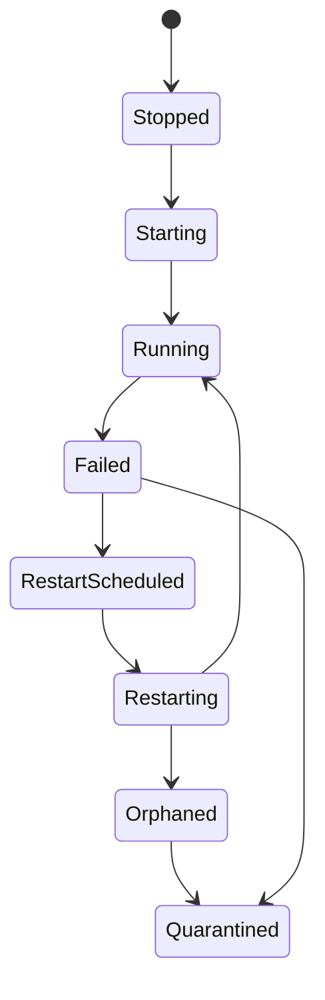

# Supervisor et cycle de vie

`appcore-supervisor` orchestre des services dans le processus. Il ne redémarre pas le processus AppCore ; systemd, launchd, Windows Service Control Manager, container runtime ou orchestrateur restent propriétaires du processus.

Les services déclarent nom, resource, dépendances, restart policy, activation et criticité. Le supervisor valide les dépendances, calcule l'ordre topologique, démarre dans l'ordre et stoppe coopérativement.

Restart est planifié : budget, backoff/jitter, executor borné, completion. Budget épuisé mène à quarantine et action opérateur. Un worker non stoppable devient orphaned/quarantined au lieu d'être ignoré.

Suivant : [updates](/fr/architecture/updates).

