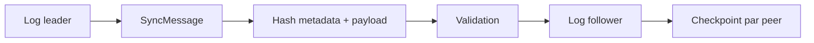

# Sync, logs, checkpoints et replay

Sync dans AppCore est une réplication conservative leader-to-follower. Ce n'est pas RAFT, multi-master ou un résolveur de conflits métier.

Quand la boutique perd Internet, les commands locales peuvent continuer selon la politique de storage et command. Quand le réseau revient, le receiver valide identité, protocole, séquence, count, taille, hash, previous hash et checkpoint.

Le log file-backed utilise `# appcore-replication-log-v1`, limite total, limite par record, sequence map, hash chain, lock et atomic write. Append par séquence est idempotent : même séquence/même payload retourne l'index original ; même séquence/payload différent est un conflit.

Checkpoint garde dernière séquence acceptée et batch hash par peer dans `# appcore-sync-checkpoint-v1`. Sans checkpoint, recovery devrait replay tout l'historique ou deviner depuis une projection.

Suivant : [fonctionnement distribué](/fr/architecture/distributed).

