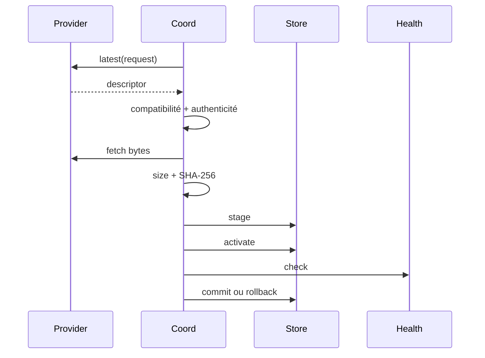

# Updates

Imaginez un update téléchargé correctement, mais dont le nouveau processus échoue au health probe. Committer cet artefact transformerait une erreur récupérable en downtime.

Les updates traitent les artefacts comme des bytes opaques. Le runtime valide identité, progression de version, compatibilité, authenticité, SHA-256, staging, activation, health et rollback.

Un candidat est rejeté si application ID, channel, version, build ID, runtime requirement ou protocol version ne conviennent pas. Production exige un verifier explicite. Ed25519 utilise des trust roots du deployment avec états active/deprecated/revoked.

Le chemin two-phase permet restart/probe avant commit. Les lectures rejettent symlinks, fichiers non réguliers et taille excessive. Les updates ne migrent pas automatiquement les schémas métier.

## Limitations

- Les updates ne migrent pas automatiquement les schémas métier.
- Le health check ne prouve pas la correction sémantique de la nouvelle version.
- Les credentials externes de deployment restent responsabilité opérateur.
- Production exige un verifier d'authenticité ; unsigned artifact est développement/test.
- Rollback couvre artifact store et activation state, pas les effets externes de la nouvelle application.

Suivant : [sécurité](/fr/security/security-model).
