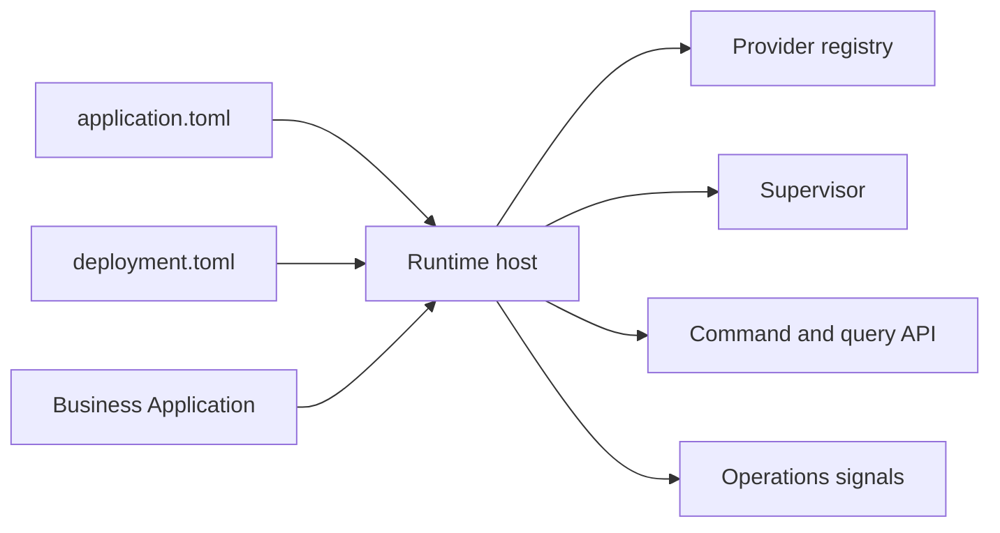

# Manifests

## Introduction

Manifests are the core portability boundary. `ApplicationManifestV1` is authored by the application and declares identity, minimum runtime version, protocol, functional capabilities, leadership needs, jobs, storage, scheduler, health, update policy, modules, and non-sensitive metadata. `DeploymentManifestV1` is authored by the installer and selects providers, paths, network bindings, secret references, and watchdog policy.

## Ownership split

| Artifact | Owns | Must not contain |
| --- | --- | --- |
| `application.toml` | Portable application requirements | Local paths, provider IDs, secrets, customer installation values |
| `deployment.toml` | Installation provider choices | Business rules, domain schemas, application source |
| Business code | Domain behavior | Runtime service assembly |

```toml
manifest_version = 1
application_id = "notes"
service_id = "notes-api"
minimum_runtime_version = "1.0.1-rc.8"
protocol = "appcore.runtime/1"

[capabilities.notes]
kind = "Functional"
commands = ["notes.create", "notes.update"]
queries = ["notes.list"]
```

```toml
manifest_version = 1
installation_id = "local-dev"
mode = "standalone"

[providers.storage]
id = "file"
path = "./var/appcore/storage"

[secrets]
runtime_security = "env:APPCORE_RUNTIME_SECRET"
```



## Pages liées

- [Getting Started](/fr/getting-started/installation)
- [Provider Concept](/fr/concepts/providers)
- [Statut du projet](/fr/introduction/project-status)
