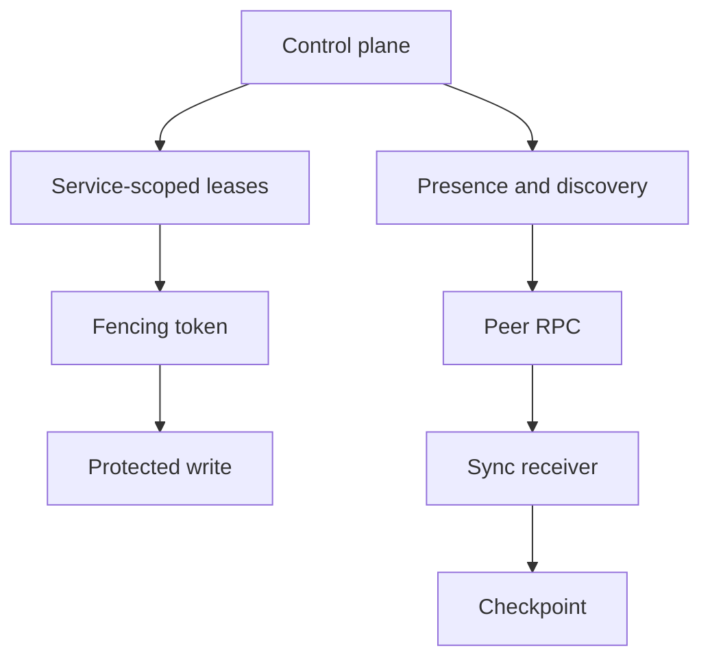

# Providers

## Introduction

Providers fournit les rôles d'infrastructure sélectionnés par des deployment manifests validés.

## Règles de décision

- Make the tenant boundary explicit.
- Prefer validated typed IDs from shared runtime types over raw strings at boundaries.
- Record accepted work before observable state changes.
- Bound payloads, files, queues, retries, and timeouts.
- Make degraded state visible instead of hiding it behind retries.

## Flux interne



## Exemples

```toml
manifest_version = 1
installation_id = "local-dev"
mode = "standalone"

[providers.storage]
id = "file"
path = "./var/appcore/storage"

[secrets]
runtime_security = "env:APPCORE_RUNTIME_SECRET"
```

## Ce que les débutants manquent souvent

- A retry is part of the contract, not an exception.
- A projection is not the source of durable truth.
- A provider name is infrastructure, not product meaning.
- Leadership without fencing is not enough.

## Limites

This concept explains the runtime boundary. Application-specific invariants, schemas, user-facing behavior, and external provider operation remain outside the concept itself.

## Pages liées

- [Commands](/fr/concepts/commands)
- [Storage Model](/fr/architecture/storage-model)
- [Security Overview](/fr/security/overview)
