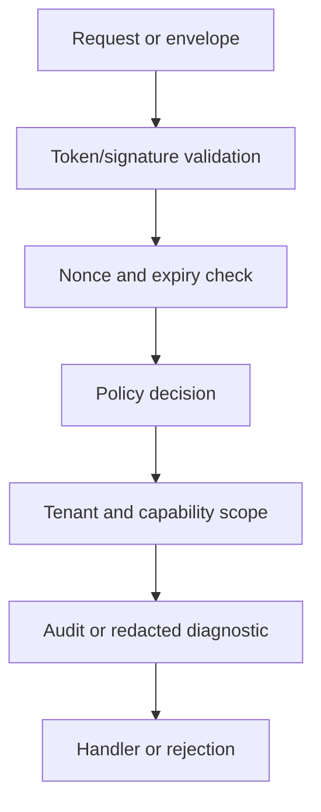

# appcore-security

## Objectif

`appcore-security`: Reusable token, secret, authentication, and policy contracts.

## Responsabilités

Tokens are signed, not encrypted. TLS, OAuth, domain authorization, and managed vaults remain external responsibilities.

## Direction des dépendances

Les crates doivent dépendre de contrats de plus bas niveau plutôt que de choix concrets de déploiement. Les implémentations de provider sont sélectionnées par des manifests et registries validés.

## Crates proches dans le runtime

- `appcore-bin` est la façade applicative manifest-first et la racine de composition.
- `appcore-transport` fournit des primitives client HTTP/TLS bornées partagées par les crates d'infrastructure.
- `appcore-scheduler` prend en charge l'exécution bornée one-shot, interval et cron.
- `appcore-ops` contient health, heartbeat, logging, métriques et observations indépendants du fournisseur.
- `appcore-distributed-contracts` possède les contrats wire/provider versionnés pour control plane et Peer RPC.
- `appcore-provider-vercel-neon` est un adapter isolé pour un control plane Vercel API appuyé par un service Neon de coordination opéré séparément.

## Flux interne



## Recommandations d'API publique

- Gardez les types exportés version-aware et sérialisables lorsqu'ils traversent des frontières de crate ou de processus.
- N'exposez pas d'internals propres à un provider dans les contrats stables.
- Gardez les concepts métier hors des crates de runtime.
- Utilisez une sortie debug expurgée pour payloads, identifiants, nonces et headers contenant des secrets.

## Usage correct

```rust
use serde::{Deserialize, Serialize};
use std::collections::BTreeMap;

#[derive(Debug, Clone, Serialize, Deserialize)]
pub struct Command {
    pub tenant_id: String,
    pub idempotency_key: String,
    pub key: String,
    pub value: String,
}

#[derive(Debug, Clone, Serialize, Deserialize)]
pub enum Event {
    Recorded { key: String, value: String },
}

#[derive(Default)]
pub struct Service {
    accepted: BTreeMap<String, Event>,
    projection: BTreeMap<String, String>,
}

impl Service {
    pub fn handle(&mut self, command: Command) -> Event {
        if let Some(event) = self.accepted.get(&command.idempotency_key) {
            return event.clone();
        }
        let event = Event::Recorded { key: command.key.clone(), value: command.value.clone() };
        self.projection.insert(command.key, command.value);
        self.accepted.insert(command.idempotency_key, event.clone());
        event
    }
}
```

## Responsabilités interdites

- Schémas et workflows métier.
- Fallback local ou non sécurisé silencieux lorsqu'un provider est indisponible.
- Files, fichiers, payloads ou retries non bornés.
- Matériel secret dans manifests, logs ou sortie debug.

## Maturité

Fait partie de la ligne runtime documentée `1.0.1-rc.8`. Traitez les signatures rustdoc exactes comme référence d'API pour la version de crate utilisée.

## Pages liées

- [Workspace](/fr/development/workspace)
- [Contracts](/fr/crates/appcore-contracts)
- [Types](/fr/crates/appcore-types)
- [Tests](/fr/development/testing)
