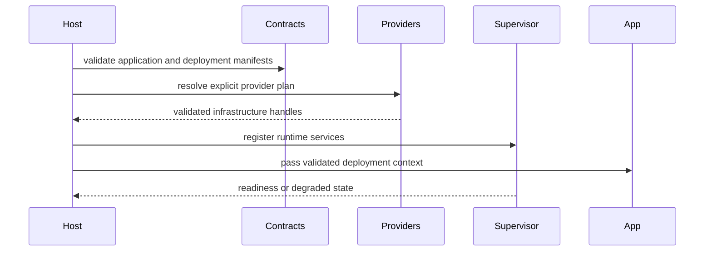

# Tests

## Introduction

This page covers unit, integration, manifest fixture, provider conformance, failure, recovery, and security tests.

## Règles de travail

- Keep public contracts in contract crates.
- Keep infrastructure providers out of application business code.
- Preserve manifest compatibility or introduce a versioned migration.
- Prefer explicit failure to silent fallback.
- Add tests for bounded inputs and recovery paths.

## Gates locaux

```bash
make doctor
make docs.check
make verify
make ci
make release.local
```

## Flux interne



## Questions de revue

- Does this change alter a stable manifest field?
- Does it introduce unbounded input, queue, retry, file, or response handling?
- Are secrets represented as references?
- Are debug outputs redacted?
- Can the behavior be tested without an external production provider?

## Pages liées

- [Workspace](/fr/development/workspace)
- [Tests](/fr/development/testing)
- [Release Process](/fr/development/release-process)
