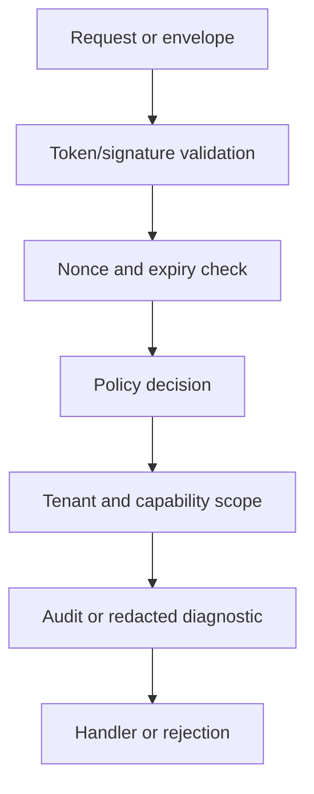

# Sécurité matérielle

:::caution Experimental
Expérimental, non stable, susceptible de changer et sans garantie de compatibilité.
:::

## Introduction

This page describes secure elements, TPMs, platform attestation, and protected local storage.

## Critères d'évaluation

- Does it preserve the three-artifact application model?
- Does it keep provider fallback explicit and fail closed?
- Can it be tested with deterministic fixtures?
- Does it change storage, update, or security contracts?
- Can operators disable it without corrupting stable runtime state?

## Flux interne



## Forme du prototype

```rust
use serde::{Deserialize, Serialize};
use std::collections::BTreeMap;

#[derive(Debug, Clone, Serialize, Deserialize)]
pub struct Command {
    pub tenant_id: String,
    pub idempotency_key: String,
    pub key: String,
    pub value: String,
}

#[derive(Debug, Clone, Serialize, Deserialize)]
pub enum Event {
    Recorded { key: String, value: String },
}

#[derive(Default)]
pub struct Service {
    accepted: BTreeMap<String, Event>,
    projection: BTreeMap<String, String>,
}

impl Service {
    pub fn handle(&mut self, command: Command) -> Event {
        if let Some(event) = self.accepted.get(&command.idempotency_key) {
            return event.clone();
        }
        let event = Event::Recorded { key: command.key.clone(), value: command.value.clone() };
        self.projection.insert(command.key, command.value);
        self.accepted.insert(command.idempotency_key, event.clone());
        event
    }
}
```

## Limites

Il n'y a pas de promesse de compatibilité. Les noms, la propriété des crates, les formats persistés, les contrats de provider et les workflows opérateur peuvent changer.

## Pages liées

- [Statut du projet](/fr/introduction/project-status)
- [Roadmap](/fr/development/roadmap)
- [Security Overview](/fr/security/overview)
