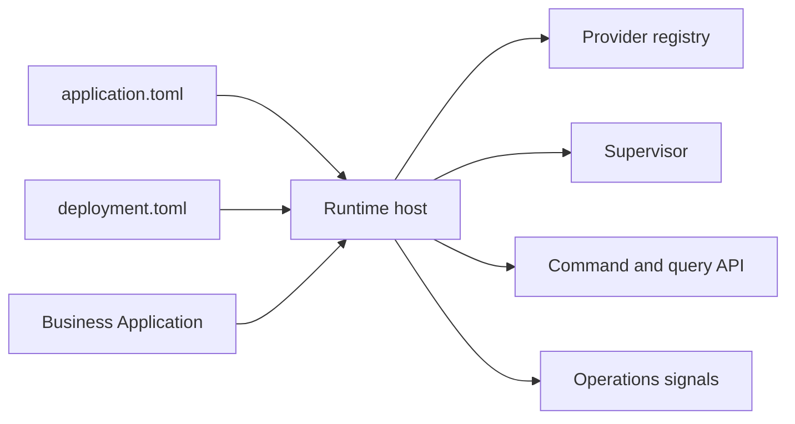

# AppCore Runtime

AppCore Runtime est un runtime Rust distribué, modulaire et local-first pour héberger des applications. Il prend en charge l'infrastructure réutilisable : cycle de vie, manifests, commands, queries, audit, contrats de stockage, sécurité, scheduling, synchronisation, capability routing, Peer RPC, coordination du control plane, observabilité, supervision et updates.

Version candidate actuelle : `1.0.1-rc.8`. Toolchain Rust minimale : `1.89`.

Ce n'est pas un ERP, une application métier, un framework web généraliste, OAuth, un coffre géré, un moteur de base de données ou un système de consensus.

## Start here

- [What Is AppCore](/fr/introduction/what-is-appcore)
- [Installation](/fr/getting-started/installation)
- [Vue d'ensemble de l'architecture](/fr/architecture/overview)
- [Statut du projet](/fr/introduction/project-status)
- [Roadmap](/fr/development/roadmap)

