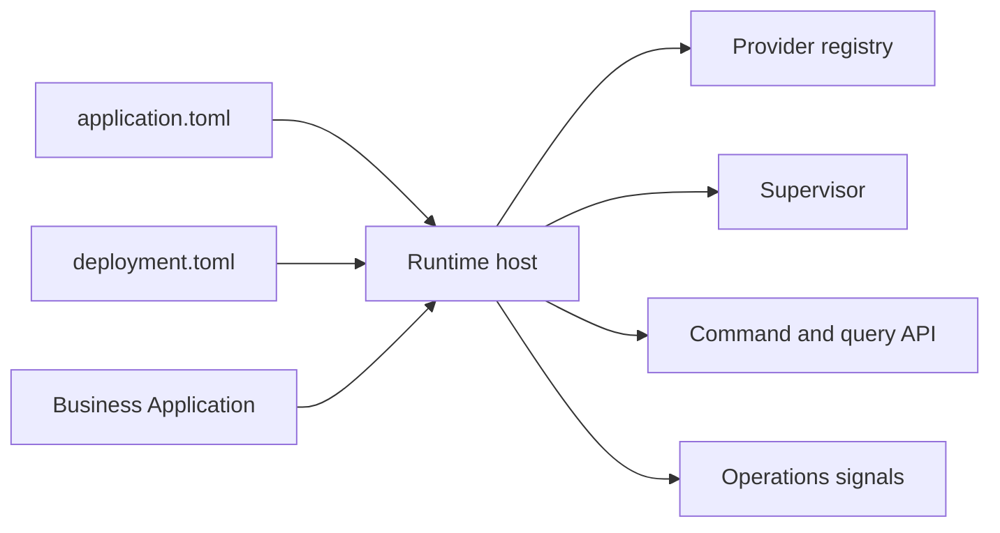

# Objectifs de conception

## Introduction

Les objectifs de conception sont la portabilité, un bootstrap déterministe, des providers explicites, une utilisation bornée des ressources, la récupérabilité et un état opérationnel lisible.

Version candidate actuelle : `1.0.1-rc.8`. Toolchain Rust minimale : `1.89`.

## Modèle de lecture

Lisez AppCore comme un ensemble de contrats plutôt que comme un monolithe. `appcore-contracts` définit les manifests et les structures de politique, `appcore-bin` compose l'hôte, les crates de bas niveau fournissent une infrastructure bornée et les dépôts applicatifs fournissent le comportement de domaine.

## À utiliser quand

- L'application doit s'exécuter à partir de manifests portables.
- Les choix d'installation ne doivent pas se retrouver dans le code métier.
- Commands, queries, audit, stockage, sync, scheduling et supervision doivent partager un même modèle de runtime.
- Vous avez besoin d'un fonctionnement local-first ou distribué avec des choix de provider explicites.

## À éviter quand

- Un handler HTTP stateless suffit.
- Vous avez besoin d'un ORM ou d'une abstraction de base de données gérée.
- Vous attendez des workflows métier intégrés.
- Vous avez besoin d'une sémantique de consensus multi-master.

## Pages liées

- [Installation](/fr/getting-started/installation)
- [Vue d'ensemble de l'architecture](/fr/architecture/overview)
- [Statut du projet](/fr/introduction/project-status)
