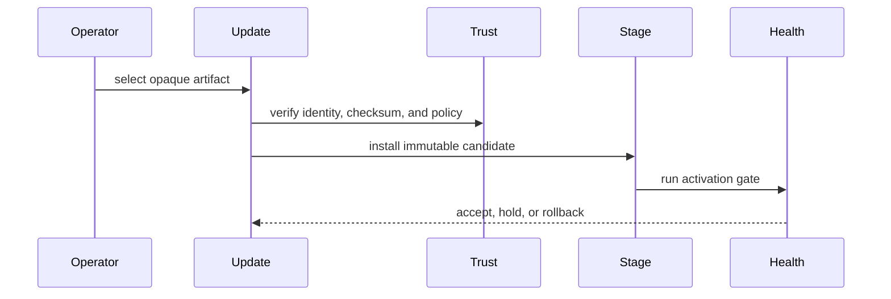

# Statut du projet

## Introduction

Version candidate actuelle : `1.0.1-rc.8`. Toolchain Rust minimale : `1.89`.

La ligne 1.0 est une ligne release-candidate avec une surface manifest-first stable. La documentation distingue contrats stables, profils d'implémentation et travail expérimental.

## Compatibility map

| Area | Status | Practical meaning |
| --- | --- | --- |
| Three-artifact contract | Stable | `application.toml`, `deployment.toml`, and `Application` are the supported application shape |
| Manifest V1 contracts | Stable | Field meanings are versioned for the 1.0 line |
| Runtime lifecycle and command/query dispatch | Stable | Core application integration point |
| Local file storage profile | Implemented | Bounded and explicit; assumes reliable local filesystem semantics |
| Gateway mesh relay | Implemented | Process-local replay/session state; edge/TLS policy remains deployment-owned |
| Sync | Implemented, conservative | Leader-to-follower replication, not consensus |
| TPM and hardware-backed security | Planned/experimental | No 1.0 RC implementation claim |
| UI Runtime, Page Builder, ILM | Experimental | No compatibility promise |

## Jamais prévu

- Business workflows.
- OAuth provider implementation.
- Managed vault.
- General database engine.
- Transparent multi-master consensus.

## Pages liées

- [Roadmap](/fr/development/roadmap)
- [Security overview](/fr/security/overview)
- [Update model](/fr/architecture/update-model)
