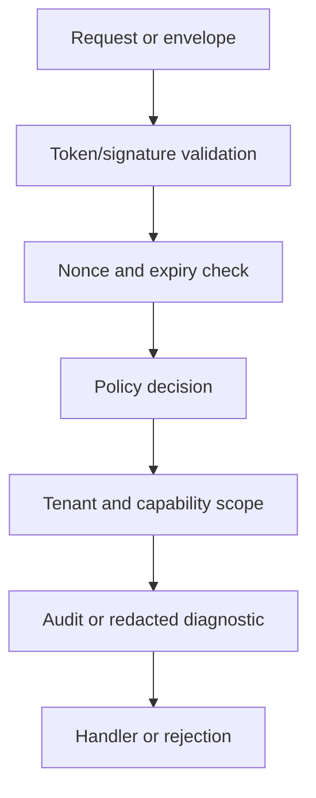

# Secrets

## Introduction

Secrets are represented by references in manifests and resolved only through selected providers after validation.

## Actifs protégés

- Runtime tokens and peer credentials.
- Tenant-scoped commands, queries, and sync frames.
- Journals, snapshots, backups, and DNT envelopes.
- Update artifacts and activation decisions.
- Operator-facing health and diagnostics.

## Non-objectifs

- Built-in OAuth.
- Managed production vault.
- TLS termination for every deployment.
- Hardware-backed keys in the 1.0 RC.
- Application business authorization rules.

## Flux interne



## Exemples

```rust
pub struct Principal {
    pub tenant_id: String,
    pub capabilities: Vec<String>,
}

pub fn may_execute(principal: &Principal, tenant_id: &str, capability: &str) -> bool {
    principal.tenant_id == tenant_id
        && principal.capabilities.iter().any(|item| item == capability)
}
```

## Checklist de revue

- Reject duplicate `Authorization` headers.
- Keep tokens signed and scoped; do not treat them as encrypted.
- Store secret references, not values.
- Redact payload bytes, credential headers, nonces, idempotency values, and remote error details from debug output.
- Require explicit insecure-test features only in test profiles.

## Limites

AppCore cannot compensate for compromised hosts, weak external secret custody, disabled TLS at the edge, or incorrect domain policy.

## Pages liées

- [Threat Model](/fr/security/threat-model)
- [Replay Protection](/fr/security/replay-protection)
- [DNT](/fr/security/dnt)
- [Secure Deployment](/fr/security/secure-deployment)
