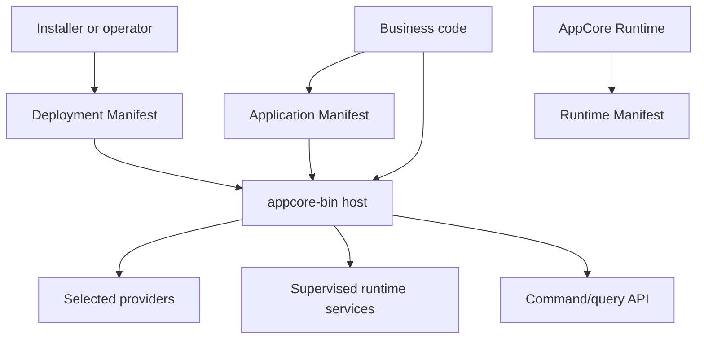
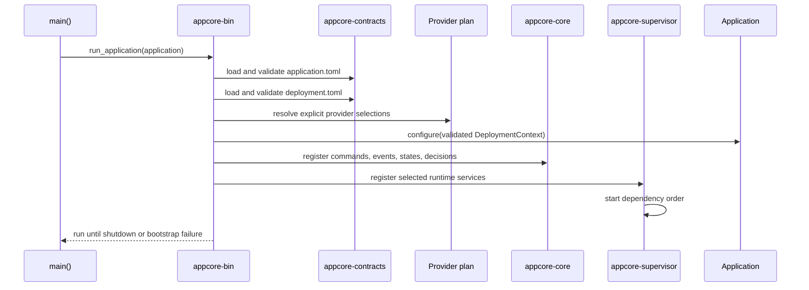

# What AppCore Is

Imagine a small business application installed in two different places.

In one installation it runs on a notebook in a shop with unreliable internet. In another installation it runs as part of a cluster where several runtime nodes share a control plane. The business code should not need two architectures. The command that records a sale, the query that reads stock, and the handler that emits application events should remain the same. What changes is installation policy: storage path, secret source, command transport, peer transport, update source, and whether distributed services are enabled.

AppCore exists for that boundary.

It is not a web framework. It is not a database. It is not a business platform. It is a runtime host that makes infrastructure decisions explicit and versioned so application code can stay focused on behavior.

## The problem it solves

Most backends start simple and then accumulate hidden runtime behavior:

- a config file becomes a mix of application identity, local paths, secrets, network addresses, and feature toggles;
- retry behavior appears inside handlers instead of at command boundaries;
- background jobs start outside lifecycle supervision;
- storage writes and backup semantics are implied by a chosen database client;
- distributed leadership is treated as a boolean instead of a lease with a fencing token;
- updates replace files before the new process has proved it is healthy.

AppCore splits these concerns into contracts.

The important part is ownership:

| Contract | Owner | Contains | Does not contain |
| --- | --- | --- | --- |
| Application Manifest | Application author | identity, compatibility, capabilities, provider-independent requirements | local paths, provider IDs, endpoints, secrets |
| Deployment Manifest | Installer/operator | mode, providers, paths, network, secret references, watchdog policy | business rules, domain schemas, source code |
| Runtime Manifest | Runtime | observed runtime version, node/core identity, health, platform, selected runtime state | user-supplied identity overrides |
| Business code | Application author | commands, queries, handlers, state, decisions, task callbacks | runtime composition, provider wiring, private host modules |

This is why AppCore documentation starts with manifests rather than crates.

## What runs when an AppCore app starts

The executable calls `appcore_bin::application::run_application(&YourApplication)`. From there, the runtime owns bootstrap:

If the application manifest and deployment manifest do not refer to the same application identity, bootstrap fails. If a removed runtime configuration shape is supplied, bootstrap stops at the update wall with `NO MORE SUPPORTED PLEASE UPDATE`. If a selected provider is missing, bootstrap fails instead of silently falling back to another provider.

## When AppCore is the right fit

Use AppCore when the application has runtime concerns that must be consistent across installations:

- local-first or cluster deployments;
- explicit command/query contracts;
- durable storage and backup policy;
- runtime-owned health and status endpoints;
- supervised runtime services;
- synchronization with sequence validation and checkpoints;
- peer RPC or gateway relay between cores;
- artifact updates with authenticity, staging, activation, health gates, and rollback.

## When not to use it

Avoid AppCore when a plain web server and one managed database are enough. It intentionally does not provide:

- a general ORM;
- product workflows;
- OAuth implementation;
- managed production vault;
- inbound TLS termination for every deployment;
- RAFT or multi-master consensus;
- automatic domain conflict resolution.

Those omissions are design boundaries. They keep runtime infrastructure reusable by applications that do not share a business domain.

## Limitations

- AppCore gives application code runtime contracts; it does not write the business model for the application.
- It makes local-first and distributed infrastructure explicit, but each deployment still needs correct provider, storage, secret, and process-manager choices.
- It validates runtime envelopes and manifests; it does not prove that domain handlers are correct.
- The stable 1.0 line intentionally favors conservative behavior over broad automatic compatibility with old config shapes.

## Read next

Continue with [the three-artifact contract](/architecture/three-artifact-contract).
