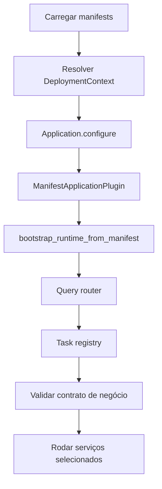

# Bootstrap e runtime host

Bootstrap começa em `run_application`. O host lê `application.toml` e `deployment.toml` ou os overrides `APPCORE_APPLICATION_MANIFEST` e `APPCORE_DEPLOYMENT_MANIFEST`, valida os manifests e cria o `ManifestApplicationHost`.

## Validações iniciais

Os paths são canonicalizados, TOML é parseado para contratos versionados e os dois manifests precisam ter o mesmo `application_id`. Entradas removidas, como `runtime.toml` ou configs antigas com `app_id` sem `manifest_version`, falham com `NO MORE SUPPORTED PLEASE UPDATE`.

## Fluxo real

O runtime deriva `RuntimeConfig`: IDs de node/core/instance pertencem ao runtime, listener vem do deployment, cluster mode habilita sync, payloads são limitados, TTLs são política do runtime e watchdog vem do deployment.

Commands continuam protegidos pelo manifest. Capability ausente falha. Command que exige idempotency key falha antes do handler se a chave não vier.

## Limites

Bootstrap não infere providers, não converte config antiga, não inicia tasks fora do scheduler e não aceita commands não declarados. Update automático exige o caminho supervisionado; execução direta não gerenciada rejeita esse modo.

Próximo: [storage](/pt/architecture/storage).

