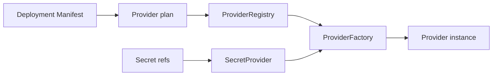

# Providers

Providers são a fronteira de instalação. O deployment escolhe infraestrutura sem alterar o artefato da aplicação.

`DeploymentProviderPlan` extrai storage, control plane, coordination store, secret provider, jobs, discovery, update, database, peer transport, command transport e adapters.

Factory é registrada por role e provider ID. Se o par selecionado não existe, creation falha. Não há fallback implícito.

Provider de coordenação é runtime-owned e não banco de negócio. Secret provider resolve referências depois da validação, mantendo valores fora dos manifests.

Próximo: [primeira aplicação](/pt/tutorials/first-application).

