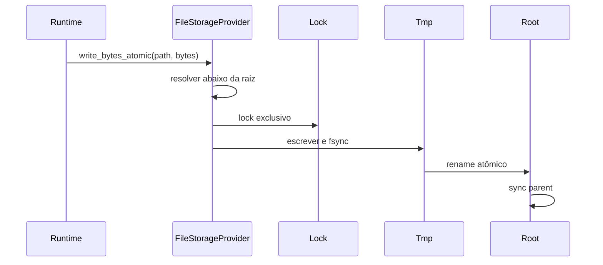
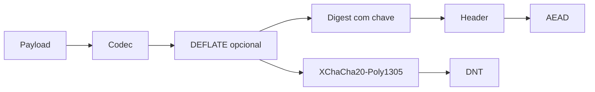

# Storage, DNT, backup e restore

Storage no AppCore não é ORM. É a fronteira de runtime para arquivos duráveis, backup, restore, objetos DNT, leituras autenticadas e health do provider.

## File provider

O provider local existe para runtime local-first. Ele rejeita paths absolutos, `..`, prefixes e symlinks dentro da raiz. Writes usam arquivo temporário, `sync_all`, rename atômico e sync do diretório pai quando suportado. Operações consistentes usam lock do sistema operacional.

Leituras inteiras são limitadas por bytes para evitar alocação sem bound.

## Backup e restore

Backup snapshot usa formato `appcore-storage-backup-v1`, inventário ordenado, tamanho e SHA-256 por arquivo. A criação é staged em diretório temporário e só depois renomeada para o backup final.

Restore copia backup verificado para `restore.pending`, move storage atual para `restore.previous`, ativa pending como storage root e remove previous. Se o processo morre no meio, `recover_snapshot_restore` escolhe pending/previous/current sem descartar a última raiz boa.

## DNT

DNT é um envelope binário autenticado e cifrado. Extensões são convenções; o header é a identidade. O header inclui application ID, tenant opcional, content type, codec, key ID, schema version, nonce, payload hash e metadata. Ele é AEAD additional data, então alterar contexto quebra autenticação.

`read_verified` exige limite de payload, rejeita arquivos grandes antes de carregar tudo e usa `open_owned` para autenticar e abrir. Plaintext retornado pode ser zeroizado.

Próximo: [sync](/pt/architecture/synchronization).

