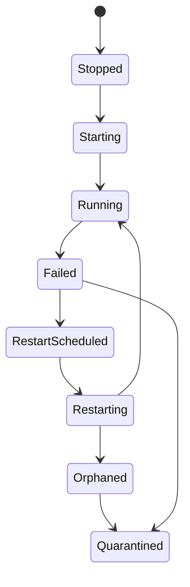

# Supervisor e ciclo de vida

`appcore-supervisor` orquestra serviços dentro do processo. Ele não reinicia o processo AppCore; isso é responsabilidade de systemd, launchd, Windows Service Control Manager, container runtime ou orquestrador.

Serviços declaram nome, recurso, dependências, restart policy, activation e criticidade. O supervisor valida dependências, calcula ordem topológica, inicia em ordem e para em cooperação.

Restart não é inline: consome orçamento, aplica backoff/jitter, agenda em executor limitado e aplica completion. Fila cheia não cria trabalho sem bound. Budget esgotado vira quarantine e exige operador.

Se shutdown não consegue parar um worker, o serviço vira orphaned/quarantined. Isso é mais correto do que fingir que o worker antigo desapareceu.

Próximo: [updates](/pt/architecture/updates).

