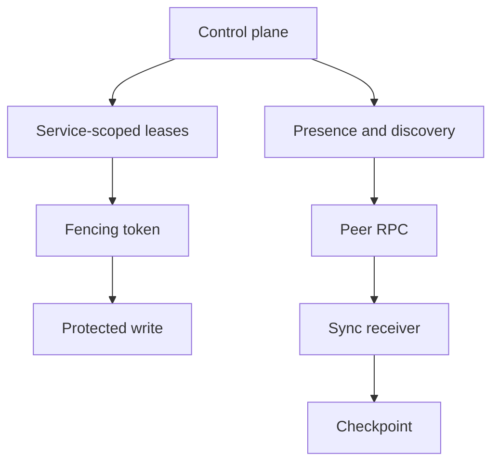

# Sincronização

## Introdução

Synchronization is conservative leader-to-follower replication with sequence and hash-chain validation.

## Fronteira de contrato

A arquitetura mantém requisitos portáveis da aplicação separados dos providers pertencentes à instalação. Código de negócio implementa comportamento da aplicação. Crates do runtime controlam infraestrutura reutilizável e rejeitam fallbacks implícitos quando um provider obrigatório está ausente.

## Consequências operacionais

| Concern | Runtime behavior | Owner outside the runtime |
| --- | --- | --- |
| Manifest validation | Fails before handlers start | Application author and installer |
| Secret references | Resolved after validation | Secret provider and operator |
| HTTP command/query API | Bounded DTOs and auth checks | TLS termination and edge policy |
| Sync | Sequence and hash-chain validation | Domain conflict policy |
| Supervision | Service restart/degrade/shutdown | OS process manager |

## Fluxo interno



## Exemplos

```rust
use serde::{Deserialize, Serialize};
use std::collections::BTreeMap;

#[derive(Debug, Clone, Serialize, Deserialize)]
pub struct Command {
    pub tenant_id: String,
    pub idempotency_key: String,
    pub key: String,
    pub value: String,
}

#[derive(Debug, Clone, Serialize, Deserialize)]
pub enum Event {
    Recorded { key: String, value: String },
}

#[derive(Default)]
pub struct Service {
    accepted: BTreeMap<String, Event>,
    projection: BTreeMap<String, String>,
}

impl Service {
    pub fn handle(&mut self, command: Command) -> Event {
        if let Some(event) = self.accepted.get(&command.idempotency_key) {
            return event.clone();
        }
        let event = Event::Recorded { key: command.key.clone(), value: command.value.clone() };
        self.projection.insert(command.key, command.value);
        self.accepted.insert(command.idempotency_key, event.clone());
        event
    }
}
```

## Modos de falha para testar

- Missing provider ID.
- Unavailable secret reference.
- Duplicate or malformed authorization header.
- Exhausted lease epoch or stale fencing token.
- Oversized HTTP body, file log, snapshot, or backup.

## Limitações

AppCore gives structure for runtime infrastructure. It does not operate your external provider, prove domain correctness, terminate TLS by default, or replace process-level supervision.

## Páginas relacionadas

- [Storage Model](/pt/architecture/storage-model)
- [Security Model](/pt/architecture/security-model)
- [Distributed Model](/pt/architecture/distributed-model)
- [Supervisor Crate](/pt/crates/appcore-supervisor)
