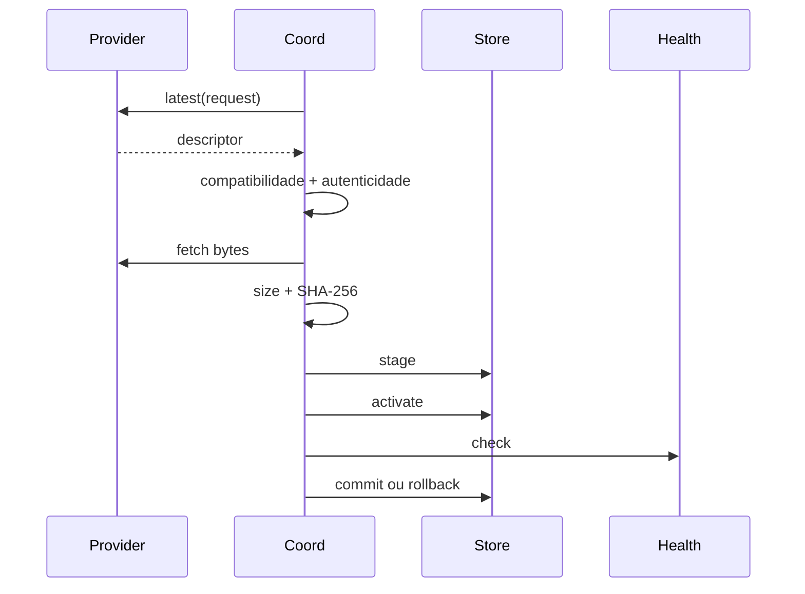

# Updates

Imagine um update baixado corretamente, mas cujo processo novo não passa no health probe. Commitar esse artefato transformaria uma falha recuperável em downtime.

Updates tratam artefatos como bytes opacos. O runtime valida identidade, avanço de versão, compatibilidade, autenticidade, SHA-256, staging, activation, health e rollback.

Candidate é rejeitado se application ID, channel, versão, build ID, runtime requirement ou protocol version não batem. Produção exige verifier explícito. Ed25519 usa trust roots do deployment com status active/deprecated/revoked.

O caminho two-phase permite restart/probe do processo antes de commit. Leituras rejeitam symlinks, arquivos não regulares e tamanho acima do limite. Updates não fazem migração de schema de negócio automaticamente.

## Limitations

- Updates não executam migração de schema de negócio automaticamente.
- Health check não prova correção semântica da nova versão.
- Credenciais externas de deployment continuam responsabilidade do operador.
- Produção exige verifier de autenticidade; artifact unsigned é caminho de desenvolvimento/teste.
- Rollback cobre artifact store e activation state, não efeitos externos feitos pela aplicação nova.

Próximo: [segurança](/pt/security/security-model).
