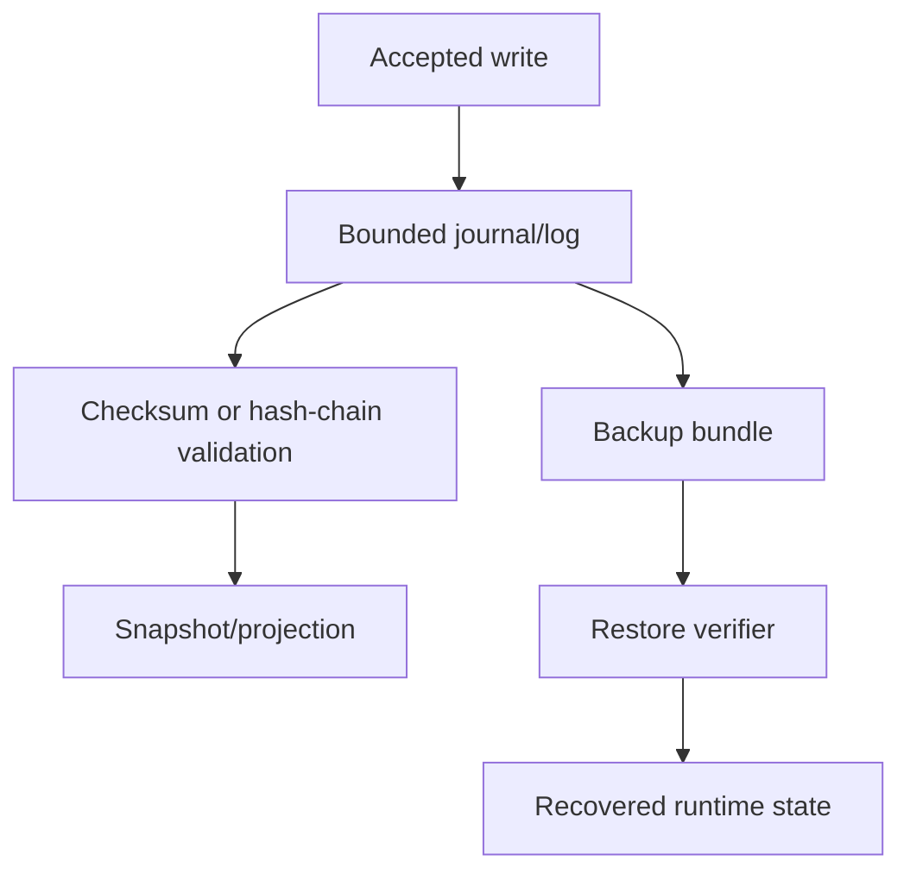

# Journals

## Introdução

Journals are append-only accepted work records used by recovery, audit, sync, and snapshot rebuild.

## Regras de decisão

- Make the tenant boundary explicit.
- Prefer validated typed IDs from shared runtime types over raw strings at boundaries.
- Record accepted work before observable state changes.
- Bound payloads, files, queues, retries, and timeouts.
- Make degraded state visible instead of hiding it behind retries.

## Fluxo interno



## Exemplos

```rust
use serde::{Deserialize, Serialize};
use std::collections::BTreeMap;

#[derive(Debug, Clone, Serialize, Deserialize)]
pub struct Command {
    pub tenant_id: String,
    pub idempotency_key: String,
    pub key: String,
    pub value: String,
}

#[derive(Debug, Clone, Serialize, Deserialize)]
pub enum Event {
    Recorded { key: String, value: String },
}

#[derive(Default)]
pub struct Service {
    accepted: BTreeMap<String, Event>,
    projection: BTreeMap<String, String>,
}

impl Service {
    pub fn handle(&mut self, command: Command) -> Event {
        if let Some(event) = self.accepted.get(&command.idempotency_key) {
            return event.clone();
        }
        let event = Event::Recorded { key: command.key.clone(), value: command.value.clone() };
        self.projection.insert(command.key, command.value);
        self.accepted.insert(command.idempotency_key, event.clone());
        event
    }
}
```

## O que iniciantes costumam perder

- A retry is part of the contract, not an exception.
- A projection is not the source of durable truth.
- A provider name is infrastructure, not product meaning.
- Leadership without fencing is not enough.

## Limitações

This concept explains the runtime boundary. Application-specific invariants, schemas, user-facing behavior, and external provider operation remain outside the concept itself.

## Páginas relacionadas

- [Commands](/pt/concepts/commands)
- [Storage Model](/pt/architecture/storage-model)
- [Security Overview](/pt/security/overview)
