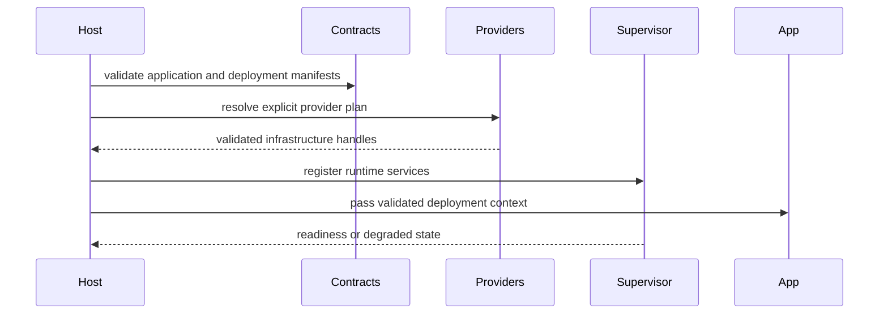

# appcore-sync

## Objetivo

`appcore-sync`: Conservative leader-to-follower replication with versioned wire, log, snapshots, checkpoints, outbox, receiver, and transport contracts.

## Responsabilidades

It is not RAFT, multi-master consensus, or a domain conflict resolver.

## Direção de dependência

Crates devem depender de contratos de nível mais baixo, não de escolhas concretas de deployment. Implementações de provider são selecionadas por manifests e registries validados.

## Crates próximos no runtime

- `appcore-bin` é a facade de aplicação manifest-first e a raiz de composição.
- `appcore-transport` fornece primitivas HTTP/TLS limitadas compartilhadas por crates de infraestrutura.
- `appcore-scheduler` controla execução limitada de tarefas one-shot, interval e cron.
- `appcore-ops` contém health, heartbeat, logging, métricas e observações sem dependência de vendor.
- `appcore-distributed-contracts` controla contratos versionados de wire/provider para control plane e Peer RPC.
- `appcore-provider-vercel-neon` é um adapter isolado para um control plane Vercel API apoiado por um serviço Neon de coordenação operado externamente.

## Fluxo interno



## Orientação de API pública

- Mantenha tipos exportados version-aware e serializáveis quando cruzam fronteiras de crate ou processo.
- Não exponha detalhes internos de provider por contratos estáveis.
- Mantenha conceitos de negócio fora dos crates de runtime.
- Use output de debug redigido para payloads, credenciais, nonces e headers que carregam secrets.

## Uso correto

```rust
use serde::{Deserialize, Serialize};
use std::collections::BTreeMap;

#[derive(Debug, Clone, Serialize, Deserialize)]
pub struct Command {
    pub tenant_id: String,
    pub idempotency_key: String,
    pub key: String,
    pub value: String,
}

#[derive(Debug, Clone, Serialize, Deserialize)]
pub enum Event {
    Recorded { key: String, value: String },
}

#[derive(Default)]
pub struct Service {
    accepted: BTreeMap<String, Event>,
    projection: BTreeMap<String, String>,
}

impl Service {
    pub fn handle(&mut self, command: Command) -> Event {
        if let Some(event) = self.accepted.get(&command.idempotency_key) {
            return event.clone();
        }
        let event = Event::Recorded { key: command.key.clone(), value: command.value.clone() };
        self.projection.insert(command.key, command.value);
        self.accepted.insert(command.idempotency_key, event.clone());
        event
    }
}
```

## Responsabilidades proibidas

- Schemas e workflows de negócio.
- Fallback local ou inseguro silencioso quando um provider está indisponível.
- Filas, arquivos, payloads ou retries sem limite.
- Material secreto em manifests, logs ou output de debug.

## Maturidade

Parte da linha documentada `1.0.1-rc.8` do runtime. Trate as assinaturas exatas do rustdoc como a referência de API da versão do crate em uso.

## Páginas relacionadas

- [Workspace](/pt/development/workspace)
- [Contracts](/pt/crates/appcore-contracts)
- [Types](/pt/crates/appcore-types)
- [Testes](/pt/development/testing)
