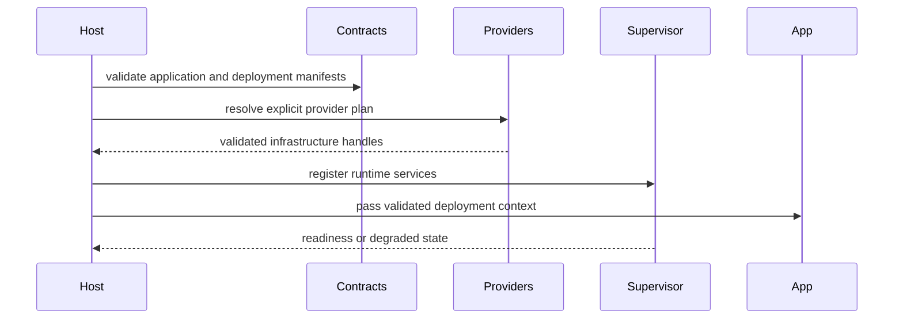

# Workspace

## Introdução

This page covers crate boundaries, Rust 1.89, workspace versioning, tooling, and runtime/application separation.

## Regras de trabalho

- Keep public contracts in contract crates.
- Keep infrastructure providers out of application business code.
- Preserve manifest compatibility or introduce a versioned migration.
- Prefer explicit failure to silent fallback.
- Add tests for bounded inputs and recovery paths.

## Gates locais

```bash
make doctor
make docs.check
make verify
make ci
make release.local
```

## Fluxo interno



## Perguntas de revisão

- Does this change alter a stable manifest field?
- Does it introduce unbounded input, queue, retry, file, or response handling?
- Are secrets represented as references?
- Are debug outputs redacted?
- Can the behavior be tested without an external production provider?

## Páginas relacionadas

- [Workspace](/pt/development/workspace)
- [Testes](/pt/development/testing)
- [Release Process](/pt/development/release-process)
