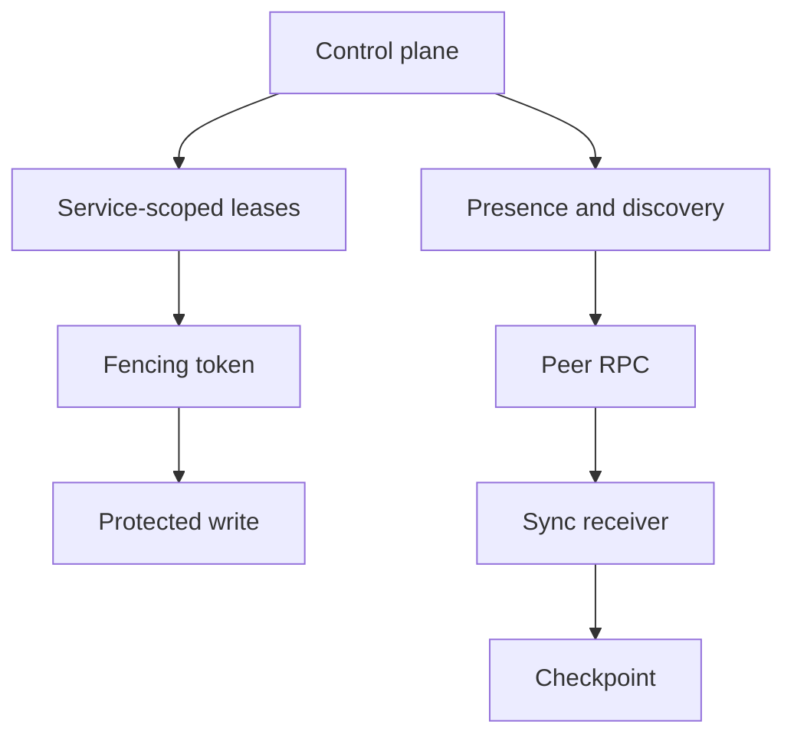

# Gateway

## Introdução

This example focuses on tenant-aware gateway routing through opaque peer envelopes.

## Padrão mínimo

```toml
manifest_version = 1
installation_id = "local-dev"
mode = "standalone"

[providers.storage]
id = "file"
path = "./var/appcore/storage"

[secrets]
runtime_security = "env:APPCORE_RUNTIME_SECRET"
```

## Fluxo



## O que copiar

- Stable command names.
- Idempotency handling.
- Tenant context.
- Explicit provider or transport assumptions.

## O que não copiar cegamente

- In-memory persistence for production.
- Missing authorization policy.
- Unbounded payloads.
- Direct coupling between API routes and storage records.

## Páginas relacionadas

- [Tutorials](/pt/tutorials/todo-app)
- [Concepts](/pt/concepts/commands)
- [Operations](/pt/operations/deployment)
