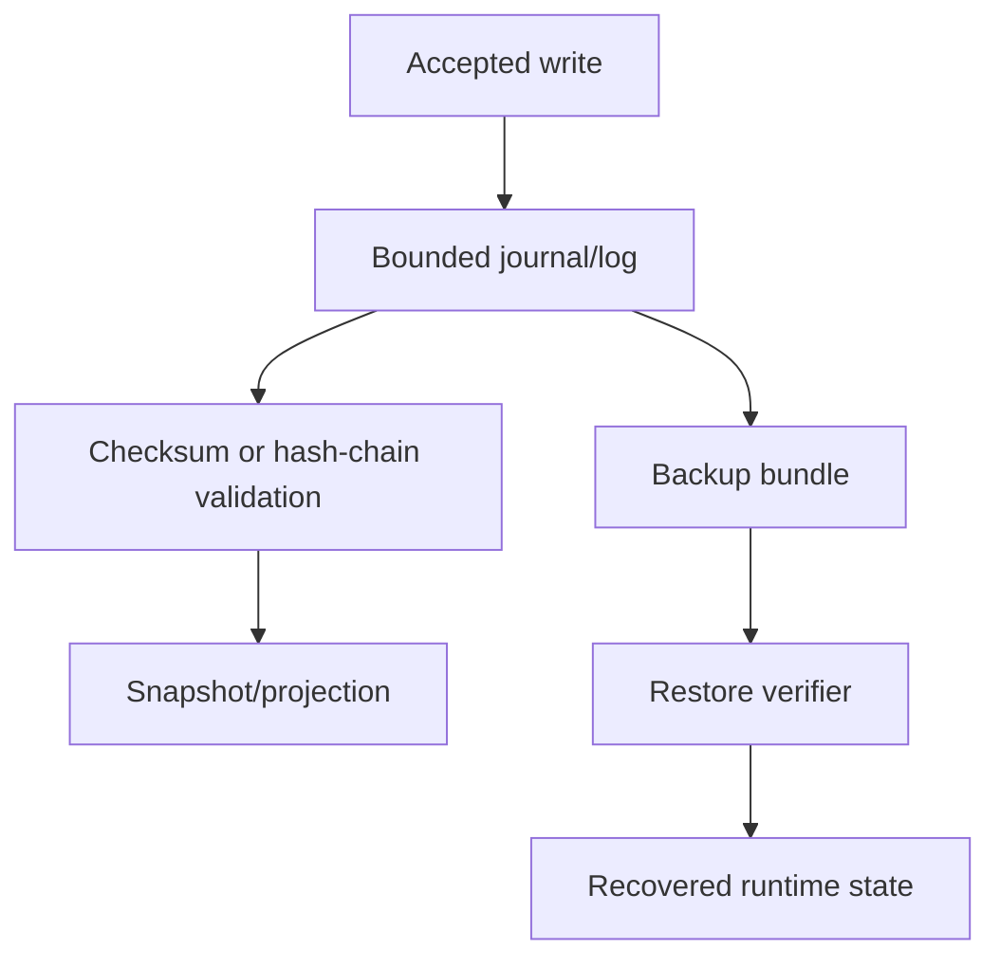

# ILM

:::caution Experimental
Experimental, não estável, pode mudar e não possui garantia de compatibilidade.
:::

## Introdução

This page describes information lifecycle management for retention, compaction, archival, and deletion policy.

## Critérios de avaliação

- Does it preserve the three-artifact application model?
- Does it keep provider fallback explicit and fail closed?
- Can it be tested with deterministic fixtures?
- Does it change storage, update, or security contracts?
- Can operators disable it without corrupting stable runtime state?

## Fluxo interno



## Forma do protótipo

```rust
use serde::{Deserialize, Serialize};
use std::collections::BTreeMap;

#[derive(Debug, Clone, Serialize, Deserialize)]
pub struct Command {
    pub tenant_id: String,
    pub idempotency_key: String,
    pub key: String,
    pub value: String,
}

#[derive(Debug, Clone, Serialize, Deserialize)]
pub enum Event {
    Recorded { key: String, value: String },
}

#[derive(Default)]
pub struct Service {
    accepted: BTreeMap<String, Event>,
    projection: BTreeMap<String, String>,
}

impl Service {
    pub fn handle(&mut self, command: Command) -> Event {
        if let Some(event) = self.accepted.get(&command.idempotency_key) {
            return event.clone();
        }
        let event = Event::Recorded { key: command.key.clone(), value: command.value.clone() };
        self.projection.insert(command.key, command.value);
        self.accepted.insert(command.idempotency_key, event.clone());
        event
    }
}
```

## Limitações

Não há promessa de compatibilidade. Nomes, ownership de crates, formatos persistidos, contratos de provider e workflows operacionais podem mudar.

## Páginas relacionadas

- [Status do projeto](/pt/introduction/project-status)
- [Roadmap](/pt/development/roadmap)
- [Security Overview](/pt/security/overview)
