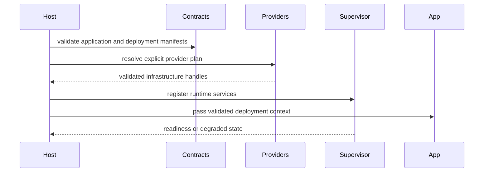

# Hello World

## Introdução

Esta página transforma o contrato do runtime em um primeiro passo concreto. A forma importante é estável: um Application Manifest portável, um Deployment Manifest pertencente à instalação e código de negócio implementando `Application`.

## Passos

1. Create a minimal `Application` implementation.
2. Register one command.
3. Run through `run_application`.
4. Observe failure through the runtime result instead of panicking.

## Aplicação mínima

```rust
use appcore_bin::application::{run_application, Application, ApplicationResult};

struct BackendApplication;

impl Application for BackendApplication {
    fn name(&self) -> &'static str {
        "notes-backend"
    }

    fn register(&self, app: &mut appcore_bin::application::ApplicationBuilder) -> ApplicationResult<()> {
        app.command("notes.create", |ctx, payload| {
            ctx.audit("notes.create.accepted")?;
            Ok(payload)
        })?;
        Ok(())
    }
}

fn main() {
    if let Err(error) = run_application(&BackendApplication) {
        eprintln!("application failed: {error}");
        std::process::exit(1);
    }
}
```

## Application Manifest

```toml
manifest_version = 1
application_id = "notes"
service_id = "notes-api"
minimum_runtime_version = "1.0.1-rc.8"
protocol = "appcore.runtime/1"

[capabilities.notes]
kind = "Functional"
commands = ["notes.create", "notes.update"]
queries = ["notes.list"]
```

## Deployment Manifest

```toml
manifest_version = 1
installation_id = "local-dev"
mode = "standalone"

[providers.storage]
id = "file"
path = "./var/appcore/storage"

[secrets]
runtime_security = "env:APPCORE_RUNTIME_SECRET"
```

## Fluxo interno



## Erros comuns

- Putting provider IDs or local paths in `application.toml`.
- Storing raw secrets in `deployment.toml`.
- Importing private host modules from application code.
- Building business REST resources inside runtime infrastructure crates.

## Limitações

The compact examples show the integration shape. Production deployment still requires TLS termination, secret management, backup policy, capacity planning, and application-owned authorization rules.

## Páginas relacionadas

- [Manifests](/pt/concepts/manifests)
- [Runtime](/pt/architecture/runtime)
- [Deployment](/pt/operations/deployment)
