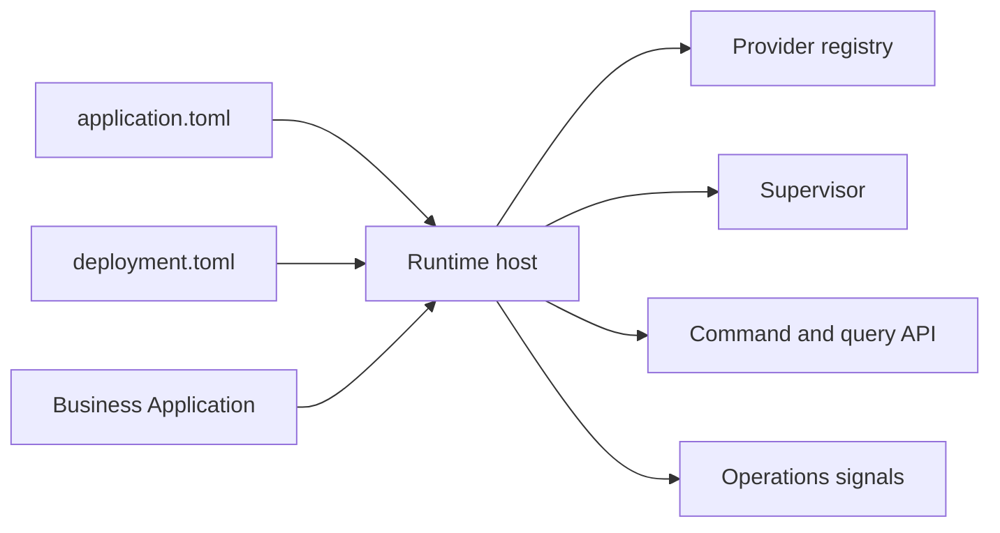

# AppCore Runtime

AppCore Runtime é um runtime Rust distribuído, modular e local-first para hospedar aplicações. Ele concentra infraestrutura reutilizável: ciclo de vida, manifests, commands, queries, auditoria, contratos de storage, segurança, scheduling, sincronização, capability routing, Peer RPC, coordenação de control plane, observabilidade, supervisão e updates.

Candidato atual: `1.0.1-rc.8`. Toolchain Rust mínima: `1.89`.

Ele não é ERP, aplicação de negócio, web framework genérico, OAuth, cofre gerenciado, mecanismo de banco de dados ou sistema de consenso.

## Start here

- [What Is AppCore](/pt/introduction/what-is-appcore)
- [Instalação](/pt/getting-started/installation)
- [Visão geral da arquitetura](/pt/architecture/overview)
- [Status do projeto](/pt/introduction/project-status)
- [Roadmap](/pt/development/roadmap)

